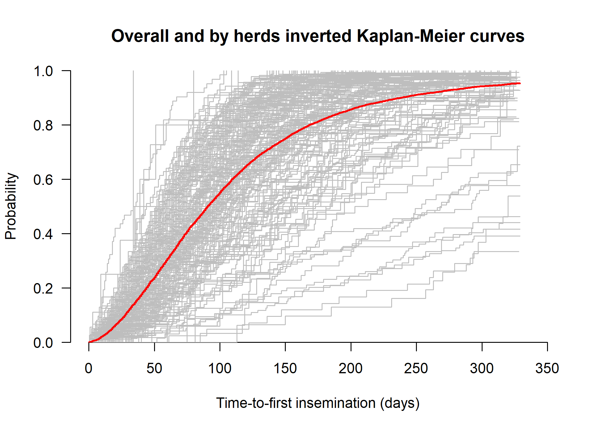
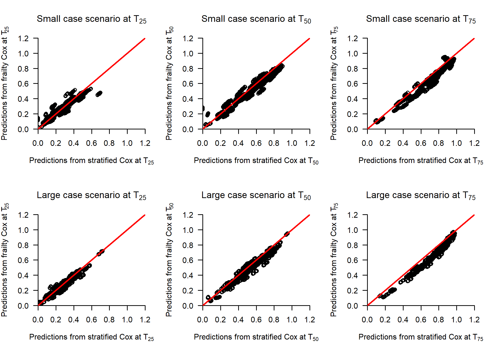

The impact of the size and the number of clusters on prediction
performance of the stratified and the conditional shared gamma frailty
Cox proportional hazards models
================
Daniele Giardiello, Edoardo Ratti, Peter C. Austin

- [**Overview**](#overview)
- [**Recap of predictions from shared gamma frailty Cox
  models**](#recap-of-predictions-from-shared-gamma-frailty-cox-models)
- [**Load packages**](#load-packages)
- [**Import useful functions**](#import-useful-functions)
- [**Import data**](#import-data)
- [**1. Descriptive statistics**](#1-descriptive-statistics)
- [**2. Analysis**](#2-analysis)
  - [**2.1 Small cluster size**](#21-small-cluster-size)
  - [**2.2 Large cluster size**](#22-large-cluster-size)
- [**3. Additional investigations**](#3-additional-investigations)
- [**Reproducibility ticket**](#reproducibility-ticket)

### **Overview**

We illustrate the analysis of the case study accompanying the simulation
study about the impact of the size and the number of clusters on
prediction performance of the stratified and the conditional shared
gamma frailty Cox proportional hazards models. The case study is the
insem data from the R package
[`parfm`](https://cran.r-project.org/web/packages/parfm/index.html)
described by the book of Duchateau and Janssen [The Frailty
Model](https://link.springer.com/book/10.1007/978-0-387-72835-3) (2008)
(example 1.8)

### **Recap of predictions from shared gamma frailty Cox models**

Two type of predictions may be possible using frailty:

- Conditional: predictions given the frailty/random effects  
  For the shared gamma frailty:

$$S_{ij}(t) = exp[-z_je^{x_{ij}\beta}H_o(t)] = exp[-H_0(t)e^{x_{ij}\beta+u_j}] = exp[-z_jH(t)] = exp[-H(t)e^{u_j}]$$

where

$$Z_j \sim \Gamma(\theta, \theta)$$

and

$$u_j = log(Z_j)$$

For details see the book written by David Collett Modelling Survival
Data in Medical Research, $4^{th}$ edition, Chapter 10 (10.2.1-10.3),
306-307. [book
link](https://www.routledge.com/Modelling-Survival-Data-in-Medical-Research/Collett/p/book/9781032252858?srsltid=AfmBOoo42UNiACd_DKYssyHu1jihtRGMmlOOjDOYl3vCK47gjs4BW1pW)

- Marginal: integrating over frailty/random effects  
  For the shared gamma frailty the marginal predictions may be used when
  the new individual does not belong to any cluster used to develop the
  model or to estimate predictions integrating over all frailty
  Conditional predictions can be used when the new individual belongs to
  a cluster used to develop the model.

$$S^*_i(t) = [1 + \theta^{-1}e^{\beta x_{ij}}H_0(t)]^{-\theta}$$

### **Load packages**

The following libraries are needed to achieve the following goals, if
you have not them installed, please use install.packages(’‘)
(e.g. install.packages(’survival’)) or use the user-friendly approach if
you are using RStudio.

<details>
<summary>
Click to expand code
</summary>

``` r
# Use pacman to check whether packages are installed, if not load
if (!require("pacman")) install.packages("pacman")
library(pacman)

pacman::p_load(
  rio,
  stringr,
  knitr,
  kableExtra,
  Hmisc,
  lattice,
  riskRegression,
  polspline,
  gtsummary,
  tidyverse,
  # furrr,
  grid,
  gridExtra,
  webshot,
  ggplot2,
  ggpubr,
  patchwork,
  rms,
  webshot2,
  parfm
)
```

</details>

### **Import useful functions**

We import useful functions

<details>
<summary>
Click to expand code
</summary>

``` r
# Useful functions
source(here::here("Functions/predict.coxph.gammafrail.R"))

# Other ad-hoc functions
# Score function with TryCatch
Score_tryCatch <- function(predictions,
                           df,
                           t_hors,
                           frm) {
  tryCatch(
  
  {
    sc <- 
      riskRegression::Score(
        list("prediction_model" = predictions),
        data = df,
        formula = frm,
        times = t_hors,
        metrics = "auc",
        summary = "ipa")
    
    # Merge AUC + IPA into a single tidy table
    score_metrics <-
      base::merge(
        sc$AUC$score[, c("model", "times", "AUC")],
        sc$Brier$score[, c("model", "times", "IPA")],
        by = c("model", "times"),
        all = TRUE)
    
    score_metrics_models <-
      score_metrics %>%
      dplyr::filter(model %nin% c("Null model"))
    
    score_metrics_models},
  
  error = function(msg) {
         message(paste("Prediction not possible"))
    
    base::expand.grid(
      times = t_hors,
      model = c("prediction_model")) %>%
      base::transform(AUC = NA_real_, 
                      IPA = NA_real_)
  })
  
}


# smoothed calibration function

calhaz_map <- function(time,
                       status,
                       covariates,
                       t_hors,
                       predictions) {
  
  tryCatch(
    {
  
  # Hazard regression
  calhaz_mod <- polspline::hare(data = time,
                                delta = status,
                                cov = covariates)
  
  # estimated cumulative probability
  pred_calhaz <- polspline::phare(t_hors,
                                  cov = covariates,
                                  fit = calhaz_mod)
  
  # ICI/E50/E90
  ICI <- mean(abs(pred_calhaz - predictions),
              na.rm = T)
  
  E50 <- median(abs(pred_calhaz - predictions),
                na.rm = T)
  
  E90 <- quantile(abs(pred_calhaz - predictions),
                  probs = .90,
                  na.rm = T)
  
  res <- c(ICI, E50, E90)
  res},
  
  error = function(msg) {
    message(paste("Calibration not possible"))
    rep(NA, 3)})
  
}
```

</details>

### **Import data**

Insem data can be imported using the `parfm` R package. We also saved
insem data in our repository in the .rds format.

<details>
<summary>
Click to expand code
</summary>

``` r
# Import from the repository
insem <- readRDS(here::here("Data/insem.rds"))

# Import from parf package
data(insem,
     package = "parfm")
```

</details>

### **1. Descriptive statistics**

We provide some descriptive statistics of the case study

<details>
<summary>
Click to expand code
</summary>

``` r
insem_tab_01 <-
  insem %>%
  dplyr::select(Ureum,
                Protein,
                Parity,
                Heifer,
                Status)

label(insem_tab_01$Ureum) <- "Milk urem concentration (%) at the start of the lactation period"
label(insem_tab_01$Protein) <- "Protein concentration (%) at the start of the lactation period"
label(insem_tab_01$Parity) <- "The number of calvings"
label(insem_tab_01$Heifer) <- "Primiparous cow"
label(insem_tab_01$Status) <- "Inseminated cow"

units(insem_tab_01$Ureum) <- "%"
units(insem_tab_01$Protein) <- "%"

gtsummary::tbl_summary(
  data = insem_tab_01 ,
  label = list(Parity ~ "Number of calvings", 
               Heifer ~ "Primiparous cow", 
               Ureum ~ "Milk urem concentration (%) ",
               Protein ~ "Protein concentration (%)",
               Status ~ "Inseminated cows"),
  type = all_continuous() ~ "continuous2",
  statistic = all_continuous() ~ c(
    "{mean} ({sd})",
    "{median} ({min}, {max})"
  ),
) %>%
  gtsummary::as_kable_extra() %>%
  kableExtra::kable_styling("striped",
                            position = "center") 
```

</details>
<table style="NAborder-bottom: 0; margin-left: auto; margin-right: auto;" class="table table-striped">
<thead>
<tr>
<th style="text-align:left;">
Characteristic
</th>
<th style="text-align:center;">
N = 10,513
</th>
</tr>
</thead>
<tbody>
<tr>
<td style="text-align:left;">
Milk urem concentration (%)
</td>
<td style="text-align:center;">
</td>
</tr>
<tr>
<td style="text-align:left;padding-left: 2em;" indentlevel="1">
Mean (SD)
</td>
<td style="text-align:center;">
2.58 (0.74)
</td>
</tr>
<tr>
<td style="text-align:left;padding-left: 2em;" indentlevel="1">
Median (Range)
</td>
<td style="text-align:center;">
2.55 (0.54, 8.24)
</td>
</tr>
<tr>
<td style="text-align:left;">
Protein concentration (%)
</td>
<td style="text-align:center;">
</td>
</tr>
<tr>
<td style="text-align:left;padding-left: 2em;" indentlevel="1">
Mean (SD)
</td>
<td style="text-align:center;">
3.25 (0.34)
</td>
</tr>
<tr>
<td style="text-align:left;padding-left: 2em;" indentlevel="1">
Median (Range)
</td>
<td style="text-align:center;">
3.21 (2.25, 6.48)
</td>
</tr>
<tr>
<td style="text-align:left;">
Number of calvings
</td>
<td style="text-align:center;">
</td>
</tr>
<tr>
<td style="text-align:left;padding-left: 2em;" indentlevel="1">
Mean (SD)
</td>
<td style="text-align:center;">
2 (2)
</td>
</tr>
<tr>
<td style="text-align:left;padding-left: 2em;" indentlevel="1">
Median (Range)
</td>
<td style="text-align:center;">
2 (1, 14)
</td>
</tr>
<tr>
<td style="text-align:left;">
Primiparous cow
</td>
<td style="text-align:center;">
4,200 (40%)
</td>
</tr>
<tr>
<td style="text-align:left;">
Inseminated cows
</td>
<td style="text-align:center;">
9,939 (95%)
</td>
</tr>
</tbody>
<tfoot>
<tr>
<td style="padding: 0; " colspan="100%">
<sup>1</sup> n (%)
</td>
</tr>
</tfoot>
</table>
<details>
<summary>
Click to expand code
</summary>

``` r
# Cluster size distribution
table_cluster <-
  insem %>%
  dplyr::group_by(Herd) %>%
  dplyr::summarise(n = n()) %>%
  dplyr::arrange(n)

par(xaxs = "i",
    yaxs = "i",
    las = 1)
barplot(table(insem$Herd),
        ylab = "Frequency",
        xlab = "Herd ID",
        ylim = c(0, 200),
        main = "Herd/cluster size")
  
# kable(table_cluster) %>%
#   kableExtra::kable_styling("striped",
#                             position = "center") %>%
#     kableExtra::add_header_above(
#      c("Cluster size distribution" = 2))
```

</details>


<details>
<summary>
Click to expand code
</summary>

``` r
# Summary cluster size
summary_cluster <-
  table_cluster %>%
  dplyr::summarise(min = min(n),
                   q25 = quantile(n, probs = .25),
                   mean = mean(n),
                   sd = sd(n),
                   median = median(n),
                   q75 = quantile(n, probs = .75),
                   max = max(n)) %>%
  round(., 1)

kable(summary_cluster) %>%
  kableExtra::kable_styling("striped") %>%
    kableExtra::add_header_above(
     c("Cluster size statistics" = 7))
```

</details>
<table class="table table-striped" style="margin-left: auto; margin-right: auto;">
<thead>
<tr>
<th style="border-bottom:hidden;padding-bottom:0; padding-left:3px;padding-right:3px;text-align: center; " colspan="7">

<div style="border-bottom: 1px solid #ddd; padding-bottom: 5px; ">

Cluster size statistics

</div>

</th>
</tr>
<tr>
<th style="text-align:right;">
min
</th>
<th style="text-align:right;">
q25
</th>
<th style="text-align:right;">
mean
</th>
<th style="text-align:right;">
sd
</th>
<th style="text-align:right;">
median
</th>
<th style="text-align:right;">
q75
</th>
<th style="text-align:right;">
max
</th>
</tr>
</thead>
<tbody>
<tr>
<td style="text-align:right;">
1
</td>
<td style="text-align:right;">
35
</td>
<td style="text-align:right;">
58.1
</td>
<td style="text-align:right;">
31.8
</td>
<td style="text-align:right;">
56
</td>
<td style="text-align:right;">
77
</td>
<td style="text-align:right;">
174
</td>
</tr>
</tbody>
</table>
<details>
<summary>
Click to expand code
</summary>

``` r
# Event distribution per cluster
# kable(
#   addmargins(
#     table(insem$Herd,
#           insem$Status,
#           useNA = "ifany",
#           dnn = c("Cluster",
#                   "Status")))) %>%
#     kableExtra::kable_styling("striped") %>%
#   kableExtra::add_header_above(
#      c("Cluster" = 1,
#        "Status" =  2,
#        "Sum" = 1))
  
# survfit
sf_overall <- survival::survfit(Surv(Time,
                                     Status) ~ 1,
                                data = insem)

sf_cluster <- survival::survfit(Surv(Time,
                                     Status) ~ Herd,
                                data = insem)


par(xaxs = "i",
    yaxs = "i", 
    las = 1)
plot(sf_cluster,
     col = "gray",
     fun = "event",
     xlim = c(0, 350),
     ylim = c(0, 1),
     bty = "n",
     xlab = "Time-to-first insemination (days)",
     ylab = "Probability",
     main = "Overall and by herds inverted Kaplan-Meier curves")
lines(sf_overall,
      fun = "event",
      lwd = 2,
      col = "red",
      conf.int = FALSE)


# Time quantiles
q_overall <- quantile(sf_overall,
                      probs = c(.25, .50, .75))$quantile
q_cluster <- 
  quantile(sf_cluster,
           probs = c(.25, .50, .75))$quantile

q_surv <- rbind.data.frame("Overall" = q_overall,
                           q_cluster)

kable(q_surv[1, ]) %>%
  kableExtra::kable_styling("striped",
                            position = "center") %>%
  kableExtra::add_header_above(
    c(" " = 1,
      "Time quantile" = 3))
```

</details>

<table class="table table-striped" style="margin-left: auto; margin-right: auto;">
<thead>
<tr>
<th style="empty-cells: hide;border-bottom:hidden;" colspan="1">
</th>
<th style="border-bottom:hidden;padding-bottom:0; padding-left:3px;padding-right:3px;text-align: center; " colspan="3">

<div style="border-bottom: 1px solid #ddd; padding-bottom: 5px; ">

Time quantile

</div>

</th>
</tr>
<tr>
<th style="text-align:left;">
</th>
<th style="text-align:right;">
25
</th>
<th style="text-align:right;">
50
</th>
<th style="text-align:right;">
75
</th>
</tr>
</thead>
<tbody>
<tr>
<td style="text-align:left;">
Overall
</td>
<td style="text-align:right;">
52
</td>
<td style="text-align:right;">
91
</td>
<td style="text-align:right;">
150
</td>
</tr>
</tbody>
</table>

### **2. Analysis**

We provide the accuracy of predictions from the stratified and the
shared gamma frailty Cox proportional hazards models in two scenarios

- Small cluster scenario: it includes herds with less than 50 cows  
- Large cluster scenario: it includes herds with at least 50 cows

The accuracy of predictions are evaluated in terms of:

- Discrimination using time-varying AUC  
- Calibration using O/E ratio, integrated calibration index (ICI), E50
  and E90  
- Overall performance using time-varying Index of Prediction Accuracy
  (IPA)

We use the Monte Carlo cross-validation procedure to assess prediction
performances of the stratified and frailty Cox model.

- The sample was split into two parts to define derivation (70%) and
  validation samples (30%)  
- The 70/30% random splits are repeated 100 times  
- The repeated random splits are stratified by herds(i.e., the cluster)
  to obtain the same herds in both the derivation and validation samples

We excluded herds with less than 10 cows since it was not possible to
obtain sufficient cows in both derivation and validation sample.

The mean of the performances metrics across the 100 random validation
samples with the corresponding standard deviation are reported for each
scenario and at each prediction time horizon to assess the prediction
performances of the stratified and the frailty Cox models.

The fixed time horizons are defined based on the $25^{th}$, $50^{th}$
and $75^{th}$ quantile fo event time overall distribution using the
Kaplan-Meier distribution which corresponds to 51, 91, 150 days,
respectively.

#### **2.1 Small cluster size**

<details>
<summary>
Click to expand code
</summary>

``` r
# time horizons
time_hors <- c(52, 91, 150)

# reference values for continuous
# predictors
insem_ref <-
  insem %>%
  dplyr::mutate(
    Ureum_ref = Ureum - 2.5,
    Protein_ref = Protein - 2.5,
    Parity_ref = Parity - 2.5)


# Herds >= 50 cows
table_insem_small <-
  insem_ref %>%
  dplyr::count(Herd) %>%
  dplyr::filter(n < 50 & n >= 10)

df_insem_small <- 
  insem_ref %>%
  dplyr::filter(Herd %in% table_insem_small$Herd)

# Repeat B times
B <- 110
df_tbl_insem_ext <- do.call(rbind, 
                        lapply(seq(1:B), 
                               function(k) {
                                 cbind(id = k, df_insem_small)}))
# Nested tibble
set.seed(20250924)
df_tbl_insem <-
  df_tbl_insem_ext %>%
  dplyr::group_nest(id) %>%
  dplyr::mutate(
    # Splitting
    split = purrr::map(.x = data,
                       ~ rsample::initial_split(.x,
                                                strata = Herd,
                                                prop = 0.7,
                                                pool = 0.001)),
    # Development
    development = purrr::map(.x = split,
                             ~ rsample::training(.x)),
      
    # Validation                       
    validation = purrr::map(.x = split,
                             ~ rsample::testing(.x)),
    
    # Check 
    unique_cluster_dev = purrr::map(.x = development,
                                    ~ unique(.x$Herd)),
    
    unique_cluster_val = purrr::map(.x = validation,
                                    ~ unique(.x$Herd)),
    
    check = purrr::map2(.x = unique_cluster_dev,
                        .y = unique_cluster_val,
                        ~ all.equal(.x, .y)))
                                    
                                    
# table(do.call(rbind, df_tbl_insem$check))  
rm(df_tbl_insem_ext)
# gc()
# check
# table(do.call(rbind, df_tbl_insem$check))
# all TRUE

# Rewrite B
B <- 100

# Models + predictions + performances
# tictoc::tic()
df_tbl_insem <-
  df_tbl_insem %>%
  dplyr::filter(check == TRUE) %>%
  dplyr::select(data,
                development,
                validation) %>%
  
  dplyr::mutate(
    cox_strat = purrr::map(.x = development,
                           ~ survival::coxph(Surv(Time, Status) ~ 
                                               Heifer +
                                               Parity_ref +
                                               Ureum_ref + 
                                               Protein_ref +
                                               strata(Herd), 
                                             data = .x,
                                             x = T,
                                             y = T, 
                                             ties = "breslow")),
    
    cox_frail = purrr::map(.x = development,
                           ~ survival::coxph(Surv(Time, Status) ~ 
                                               Heifer +
                                               Parity_ref +
                                               Ureum_ref + 
                                               Protein_ref +  
                                               frailty(Herd), 
                                             data = .x, 
                                             x = T, 
                                             y = T,
                                             ties = "breslow")),
    
    # predictions at t25/t50/t75
    # stratified cox
    pred_strat = purrr::map2(.x = cox_strat,
                             .y = validation,
                             ~ 1 - pec::predictSurvProb(.x,
                                                        newdata = .y,
                                                        times = time_hors)),
    # Extremes to make calibration suitable
    pred_strat = purrr::map(pred_strat,
                            function(x) { 
                              x <- ifelse(x == 0, 0.000001, x)
                              x <- ifelse(x == 1, 0.999999, x)
                              x}),

    # separate prediction by time horizons 
    # due to possible missing values 
    pred_strat_t25 = purrr::map(.x = pred_strat,
                                ~ .x[, 1]),
    
    pred_strat_t50 = purrr::map(.x = pred_strat,
                                ~ .x[, 2]),
    
    pred_strat_t75 = purrr::map(.x = pred_strat,
                                ~ .x[, 3]),
    
    pred_frail = purrr::map2(.x = cox_frail,
                             .y = validation,
                             ~ 1 - predict.coxph.gammafrail(model = .x,
                                                            newdata = .y,
                                                            cluster = "Herd",
                                                            times = time_hors)$conditional),
    # Extremes to make calibration suitable
    pred_frail = purrr::map(pred_frail,
                            function(x) { 
                              x <- ifelse(x == 0, 0.000001, x)
                              x <- ifelse(x == 1, 0.999999, x)
                              x}),
    
    # Score at t25/t50/t75 - frail
    score_frail = purrr::map2(.x = pred_frail,
                              .y = validation,
                              ~ riskRegression::Score(
                                list("frail" = .x),
                                data = .y,
                                formula = Surv(Time, Status) ~ 1,
                                metrics = "auc",
                                summary = "ipa",
                                times = time_hors)),
    
    # save results score - frail
    score_frail_res = purrr::map(score_frail,
                                 function(x) {
                                   
                                   res_AUC <- 
                                     x$AUC$score %>%
                                     dplyr::select(model, times, AUC)
                                   
                                   res_IPA <-
                                     x$Brier$score %>%
                                     dplyr::select(model, times, IPA) %>%
                                     dplyr::filter(model %nin% c("Null model"))
                                   
                                   res <- cbind(res_AUC,
                                                "IPA" = res_IPA$IPA)
                                   
                                   return(res)
                                 }),
                          
    # Score at t25 - strata
   score_strat_t25 = purrr::pmap(
      list(predictions = pred_strat_t25,
           df = validation,
           frm = list(as.formula(Surv(Time, Status) ~ 1)),
           t_hors = list(time_hors[1])),
      Score_tryCatch),
    
    
    # Score at t50 - strata
    score_strat_t50 = purrr::pmap(
      list(predictions = pred_strat_t50,
           df = validation,
           frm = list(as.formula(Surv(Time, Status) ~ 1)),
           t_hors = list(time_hors[2])),
      Score_tryCatch),
    
    # Score at t75 - strata
    score_strat_t75 = purrr::pmap(
      list(predictions = pred_strat_t75,
           df = validation,
           frm = list(as.formula(Surv(Time, Status) ~ 1)),
           t_hors = list(time_hors[3])),
      Score_tryCatch),
    
    
    # cloglog
    # cloglog - strat
    cloglog_pred_strat = purrr::map(pred_strat,
                                    function(x) {
                                      apply(x, 2, function(y) {
                                        log(-log(1 - y))
                                      })
                                    }),
   
   # cloglog - strat t25/t50/t75
   cloglog_pred_strat_t25 = purrr::map(.x = cloglog_pred_strat,
                                       ~ .x[, 1]),
   
   cloglog_pred_strat_t50 = purrr::map(.x = cloglog_pred_strat,
                                       ~ .x[, 2]),
   
   cloglog_pred_strat_t75 = purrr::map(.x = cloglog_pred_strat,
                                       ~ .x[, 3]),
   
    # cloglog
    # cloglog - frail
    cloglog_pred_frail = purrr::map(pred_frail,
                                    function(x) {
                                      apply(x, 2, function(y) {
                                        log(-log(1 - y))
                                      })
                                    }),
   # cloglog - frail t25/t50/t75
    cloglog_pred_frail_t25 = purrr::map(.x = cloglog_pred_frail,
                                        ~ .x[, 1]),
   
    cloglog_pred_frail_t50 = purrr::map(.x = cloglog_pred_frail,
                                        ~ .x[, 2]),
   
    cloglog_pred_frail_t75 = purrr::map(.x = cloglog_pred_frail,
                                        ~ .x[, 3]),
   

    # average expected risk
    pred_avg_strat = purrr::map(pred_strat,
                                function(x){
                                  apply(x, 2, mean)
                                }),
   
    pred_avg_frail = purrr::map(pred_frail,
                                function(x) {
                                 apply(x, 2, mean)
                               }),
   
    # estimated actual risk (estimated obs proportion, observed)
    sf_obs = purrr::map(validation,
                        function(x) {
                          sf_sum <- 
                            summary(survival::survfit(Surv(Time, Status) ~ 1,
                                                      data = x),
                                    extend = TRUE,
                                    times = time_hors)
                          
                          sf_sum$surv[sf_sum$n.risk == 0] <- NA
                          sf_obs_event <- 1 - sf_sum$surv}),
   
   # calibration
   
   # OE ratio - strat
   OE_strat = purrr::map2(.x = sf_obs,
                          .y = pred_avg_strat,
                          ~ .x / .y),
   
    # OE ratio - frail
   OE_frail = purrr::map2(.x = sf_obs,
                          .y = pred_avg_frail,
                          ~ .x / .y),
   
   # ICI/E50/E90 - frail t25
   cal_meas_frail_t25  = purrr::pmap(
     list(time = purrr::map(validation, ~ .x$Time),
          status = purrr::map(validation, ~ .x$Status),
          covariates = cloglog_pred_frail_t25,
          t_hors = list(time_hors[1]),
          predictions = purrr::map(pred_frail, ~ .x[, 1])),
          calhaz_map),
   
   # ICI/E50/E90 - frail t50
   cal_meas_frail_t50  = purrr::pmap(
     list(time = purrr::map(validation, ~ .x$Time),
          status = purrr::map(validation, ~ .x$Status),
          covariates = cloglog_pred_frail_t50,
          t_hors = list(time_hors[2]),
          predictions = purrr::map(pred_frail, ~ .x[, 2])),
          calhaz_map),
   
   # ICI/E50/E90 - frail t75
   cal_meas_frail_t75  = purrr::pmap(
     list(time = purrr::map(validation, ~ .x$Time),
          status = purrr::map(validation, ~ .x$Status),
          covariates = cloglog_pred_frail_t75,
          t_hors = list(time_hors[3]),
          predictions = purrr::map(pred_frail, ~ .x[, 3])),
          calhaz_map),
   
   # stratify
   # ICI/E50/E90 - strat t25
   cal_meas_strat_t25  = purrr::pmap(
     list(time = purrr::map(validation, ~ .x$Time),
          status = purrr::map(validation, ~ .x$Status),
          covariates = cloglog_pred_strat_t25,
          t_hors = list(time_hors[1]),
          predictions = purrr::map(pred_strat, ~ .x[, 1])),
          calhaz_map),
   
   # ICI/E50/E90 - strat t50
   cal_meas_strat_t50  = purrr::pmap(
     list(time = purrr::map(validation, ~ .x$Time),
          status = purrr::map(validation, ~ .x$Status),
          covariates = cloglog_pred_strat_t50,
          t_hors = list(time_hors[2]),
          predictions = purrr::map(pred_strat, ~ .x[, 2])),
          calhaz_map),
   
   # ICI/E50/E90 - strat t75
   cal_meas_strat_t75  = purrr::pmap(
     list(time = purrr::map(validation, ~ .x$Time),
          status = purrr::map(validation, ~ .x$Status),
          covariates = cloglog_pred_strat_t75,
          t_hors = list(time_hors[3]),
          predictions = purrr::map(pred_strat, ~ .x[, 3])),
          calhaz_map))
   
# tictoc::toc()
```

</details>
<details>
<summary>
Click to expand code
</summary>

``` r
# NOTE: for long time computation we saved the results directly
# However, one can remove comments for the above code to 
# reproduce exactly the same results

# Aggregating results
# 
# # Discrimination
# df_frail_discr <-   do.call(rbind, df_tbl_insem$score_frail_res)
# df_strat_discr <- rbind(do.call(rbind, df_tbl_insem$score_strat_t25),
#                         do.call(rbind, df_tbl_insem$score_strat_t50),
#                         do.call(rbind, df_tbl_insem$score_strat_t75))
# 
# # Discrimination stratify + frailty
# df_discr_res <- 
#   rbind(df_strat_discr,
#         df_frail_discr) %>%
#   dplyr::mutate(model = dplyr::case_when(model == "prediction_model" ~ "strat",
#                                          .default = "frail"))
# 
# # Usable comparisons
# df_discr_res_miss <-
#   df_discr_res %>%
#   dplyr::group_by(model, times) %>%
#   dplyr::summarise(miss_comp = round((sum(is.na(AUC)) / B) * 100, 2)) %>%
#   dplyr::mutate(usable_comp = 100 - miss_comp)
# 
# rm(df_frail_discr,
#    df_strat_discr)
# 
# # calibration measures results
# 
# # calibration measures
# df_cal_res <- 
#   data.frame(
#     model = rep(c("strat", "frail"), each = B * length(time_hors)), 
#     times = rep(time_hors, each = B)) %>%
#   
#     dplyr::bind_cols(
#       rbind(
#         do.call(rbind, df_tbl_insem$cal_meas_strat_t25),
#         do.call(rbind, df_tbl_insem$cal_meas_strat_t50),
#         do.call(rbind, df_tbl_insem$cal_meas_strat_t75),
#         
#         do.call(rbind, df_tbl_insem$cal_meas_frail_t25),
#         do.call(rbind, df_tbl_insem$cal_meas_frail_t50),
#         do.call(rbind, df_tbl_insem$cal_meas_frail_t75))) %>%
#   
#   dplyr::rename(ICI = V1,
#                 E50 = V2,
#                 E90 = "90%") %>%
#   
#   dplyr::mutate(
#     model = dplyr::case_when(model == "prediction_model" ~ "strat",
#                              .default = model))
# 
# 
# # O-E ratio
# df_oe_res <- 
#   data.frame(
#     model = rep(c("strat", "frail"), each = B * length(time_hors)),
#     times = rep(time_hors, times = B)) %>%
#   
#   dplyr::bind_cols(
#     rbind(
#      do.call(rbind, lapply(df_tbl_insem$OE_strat, cbind)),
#      do.call(rbind, lapply(df_tbl_insem$OE_frail, cbind)))) %>%
#   
#   dplyr::rename(
#     OE_ratio = "...3") %>%
#   
#   dplyr::arrange(desc(model), times)
#   
# 
# # All measures together
# 
# df_performances_small <-
#   df_discr_res %>%
#   dplyr::bind_cols(df_oe_res %>%
#                      dplyr::select(-model,
#                                    -times)) %>%
#   dplyr::bind_cols(df_cal_res %>%
#                      dplyr::select(-model,
#                                    -times))
# 
# # saveRDS(df_performances_small,
# #         file = here::here("Data/df_perf_casestudy_small.rds"))

df_performances_small <-
  readRDS(file = here::here("Output/df_perf_casestudy_small.rds"))

B <- 100
df_perf_small_miss <-
  df_performances_small %>%
  dplyr::group_by(model, times) %>%
  dplyr::summarise(miss_comp = round((sum(is.na(AUC)) / B) * 100, 2)) %>%
  dplyr::mutate(usable_comp = 100 - miss_comp)


# MC estimates

df_MC_performances_small <-
  df_performances_small %>%
  dplyr::filter(!is.na(AUC)) %>%
  dplyr::group_by(times, model) %>%
  dplyr::summarise(
    
    AUC_mean = mean(AUC, na.rm = T),
    AUC_low = quantile(AUC, probs = 0.025, na.rm = T),
    AUC_high = quantile(AUC, probs = 0.975, na.rm = T),
    AUC_sd = sd(AUC, na.rm = T),
    
    IPA_mean = mean(IPA, na.rm = T),
    IPA_low = quantile(IPA, probs = 0.025, na.rm = T),
    IPA_high = quantile(IPA, probs = 0.975, na.rm = T),
    IPA_sd = sd(IPA, na.rm = T),
    
    OE_ratio_mean = mean(OE_ratio, na.rm = T),
    OE_ratio_low = quantile(OE_ratio, probs = 0.025, na.rm = T),
    OE_ratio_high = quantile(OE_ratio, probs = 0.975, na.rm = T),
    OE_ratio_sd = sd(OE_ratio, na.rm = T),
    
    ICI_mean = mean(ICI, na.rm = T),
    ICI_low = quantile(ICI, probs = 0.025, na.rm = T),
    ICI_high = quantile(ICI, probs = 0.975, na.rm = T),
    ICI_sd = sd(ICI, na.rm = T),
    
    E50_mean = mean(E50, na.rm = T),
    E50_low = quantile(E50, probs = 0.025, na.rm = T),
    E50_high = quantile(E50, probs = 0.975, na.rm = T),
    E50_sd = sd(E50, na.rm = T),
    
    E90_mean = mean(E90, na.rm = T),
    E90_low = quantile(E90, probs = 0.025, na.rm = T),
    E90_high = quantile(E90, probs = 0.975, na.rm = T),
    E90_sd = sd(E50, na.rm = T)) %>%
  
   dplyr::mutate(across(where(is.numeric), ~ round(.x, 3)))


# Results
df_MC_performances_small_res <-
  df_MC_performances_small %>%
  dplyr::left_join(df_perf_small_miss,
                   by = c("model",
                          "times")) %>%
  dplyr::select(model,
                times,
                usable_comp,
                AUC_mean,
                AUC_sd,
                IPA_mean,
                IPA_sd,
                OE_ratio_mean,
                OE_ratio_sd,
                ICI_mean,
                ICI_sd,
                E50_mean,
                E50_sd,
                E90_mean,
                E90_sd) %>%
  dplyr::rename(
    pct_comp = usable_comp)


kable(df_MC_performances_small_res) %>%
  kableExtra::kable_styling("striped",
                            position = "center") %>%
    kableExtra::add_header_above(
     c(" " = 3,
       "AUC" = 2,
       "IPA" = 2,
       "O-E ratio" = 2,
       "ICI" = 2,
       "E50" = 2,
       "E90" = 2)) %>%
  kableExtra::add_header_above(
    c("Small cluster scenario" = 15))
```

</details>
<table class="table table-striped" style="margin-left: auto; margin-right: auto;">
<thead>
<tr>
<th style="border-bottom:hidden;padding-bottom:0; padding-left:3px;padding-right:3px;text-align: center; " colspan="15">

<div style="border-bottom: 1px solid #ddd; padding-bottom: 5px; ">

Small cluster scenario

</div>

</th>
</tr>
<tr>
<th style="empty-cells: hide;border-bottom:hidden;" colspan="3">
</th>
<th style="border-bottom:hidden;padding-bottom:0; padding-left:3px;padding-right:3px;text-align: center; " colspan="2">

<div style="border-bottom: 1px solid #ddd; padding-bottom: 5px; ">

AUC

</div>

</th>
<th style="border-bottom:hidden;padding-bottom:0; padding-left:3px;padding-right:3px;text-align: center; " colspan="2">

<div style="border-bottom: 1px solid #ddd; padding-bottom: 5px; ">

IPA

</div>

</th>
<th style="border-bottom:hidden;padding-bottom:0; padding-left:3px;padding-right:3px;text-align: center; " colspan="2">

<div style="border-bottom: 1px solid #ddd; padding-bottom: 5px; ">

O-E ratio

</div>

</th>
<th style="border-bottom:hidden;padding-bottom:0; padding-left:3px;padding-right:3px;text-align: center; " colspan="2">

<div style="border-bottom: 1px solid #ddd; padding-bottom: 5px; ">

ICI

</div>

</th>
<th style="border-bottom:hidden;padding-bottom:0; padding-left:3px;padding-right:3px;text-align: center; " colspan="2">

<div style="border-bottom: 1px solid #ddd; padding-bottom: 5px; ">

E50

</div>

</th>
<th style="border-bottom:hidden;padding-bottom:0; padding-left:3px;padding-right:3px;text-align: center; " colspan="2">

<div style="border-bottom: 1px solid #ddd; padding-bottom: 5px; ">

E90

</div>

</th>
</tr>
<tr>
<th style="text-align:left;">
model
</th>
<th style="text-align:right;">
times
</th>
<th style="text-align:right;">
pct_comp
</th>
<th style="text-align:right;">
AUC_mean
</th>
<th style="text-align:right;">
AUC_sd
</th>
<th style="text-align:right;">
IPA_mean
</th>
<th style="text-align:right;">
IPA_sd
</th>
<th style="text-align:right;">
OE_ratio_mean
</th>
<th style="text-align:right;">
OE_ratio_sd
</th>
<th style="text-align:right;">
ICI_mean
</th>
<th style="text-align:right;">
ICI_sd
</th>
<th style="text-align:right;">
E50_mean
</th>
<th style="text-align:right;">
E50_sd
</th>
<th style="text-align:right;">
E90_mean
</th>
<th style="text-align:right;">
E90_sd
</th>
</tr>
</thead>
<tbody>
<tr>
<td style="text-align:left;">
frail
</td>
<td style="text-align:right;">
52
</td>
<td style="text-align:right;">
100
</td>
<td style="text-align:right;">
0.688
</td>
<td style="text-align:right;">
0.015
</td>
<td style="text-align:right;">
0.075
</td>
<td style="text-align:right;">
0.016
</td>
<td style="text-align:right;">
1.066
</td>
<td style="text-align:right;">
0.074
</td>
<td style="text-align:right;">
0.045
</td>
<td style="text-align:right;">
0.032
</td>
<td style="text-align:right;">
0.046
</td>
<td style="text-align:right;">
0.035
</td>
<td style="text-align:right;">
0.070
</td>
<td style="text-align:right;">
0.035
</td>
</tr>
<tr>
<td style="text-align:left;">
strat
</td>
<td style="text-align:right;">
52
</td>
<td style="text-align:right;">
95
</td>
<td style="text-align:right;">
0.658
</td>
<td style="text-align:right;">
0.015
</td>
<td style="text-align:right;">
0.039
</td>
<td style="text-align:right;">
0.021
</td>
<td style="text-align:right;">
1.024
</td>
<td style="text-align:right;">
0.087
</td>
<td style="text-align:right;">
0.037
</td>
<td style="text-align:right;">
0.011
</td>
<td style="text-align:right;">
0.032
</td>
<td style="text-align:right;">
0.013
</td>
<td style="text-align:right;">
0.071
</td>
<td style="text-align:right;">
0.013
</td>
</tr>
<tr>
<td style="text-align:left;">
frail
</td>
<td style="text-align:right;">
91
</td>
<td style="text-align:right;">
100
</td>
<td style="text-align:right;">
0.730
</td>
<td style="text-align:right;">
0.016
</td>
<td style="text-align:right;">
0.156
</td>
<td style="text-align:right;">
0.023
</td>
<td style="text-align:right;">
1.072
</td>
<td style="text-align:right;">
0.071
</td>
<td style="text-align:right;">
0.044
</td>
<td style="text-align:right;">
0.028
</td>
<td style="text-align:right;">
0.045
</td>
<td style="text-align:right;">
0.030
</td>
<td style="text-align:right;">
0.070
</td>
<td style="text-align:right;">
0.030
</td>
</tr>
<tr>
<td style="text-align:left;">
strat
</td>
<td style="text-align:right;">
91
</td>
<td style="text-align:right;">
78
</td>
<td style="text-align:right;">
0.723
</td>
<td style="text-align:right;">
0.016
</td>
<td style="text-align:right;">
0.146
</td>
<td style="text-align:right;">
0.026
</td>
<td style="text-align:right;">
1.023
</td>
<td style="text-align:right;">
0.045
</td>
<td style="text-align:right;">
0.037
</td>
<td style="text-align:right;">
0.014
</td>
<td style="text-align:right;">
0.033
</td>
<td style="text-align:right;">
0.014
</td>
<td style="text-align:right;">
0.064
</td>
<td style="text-align:right;">
0.014
</td>
</tr>
<tr>
<td style="text-align:left;">
frail
</td>
<td style="text-align:right;">
150
</td>
<td style="text-align:right;">
100
</td>
<td style="text-align:right;">
0.813
</td>
<td style="text-align:right;">
0.016
</td>
<td style="text-align:right;">
0.229
</td>
<td style="text-align:right;">
0.038
</td>
<td style="text-align:right;">
1.058
</td>
<td style="text-align:right;">
0.081
</td>
<td style="text-align:right;">
0.045
</td>
<td style="text-align:right;">
0.027
</td>
<td style="text-align:right;">
0.047
</td>
<td style="text-align:right;">
0.030
</td>
<td style="text-align:right;">
0.068
</td>
<td style="text-align:right;">
0.030
</td>
</tr>
</tbody>
</table>

#### **2.2 Large cluster size**

<details>
<summary>
Click to expand code
</summary>

``` r
# time horizons
time_hors <- c(52, 91, 150)

# reference values for continuous
# predictors
insem_ref <-
  insem %>%
  dplyr::mutate(
    Ureum_ref = Ureum - 2.5,
    Protein_ref = Protein - 2.5,
    Parity_ref = Parity - 2.5)


# Herds >= 50 cows
table_insem_large <-
  insem_ref %>%
  dplyr::count(Herd) %>%
  dplyr::filter(n >= 50)

df_insem_large <- 
  insem_ref %>%
  dplyr::filter(Herd %in% table_insem_large$Herd)

# Repeat B times
B <- 100
df_tbl_insem_ext <- do.call(rbind, 
                        lapply(seq(1:B), 
                               function(k) {
                                 cbind(id = k, df_insem_large)}))
# Nested tibble
set.seed(20250924)
df_tbl_insem <-
  df_tbl_insem_ext %>%
  dplyr::group_nest(id) %>%
  dplyr::mutate(
    # Splitting
    split = purrr::map(.x = data,
                       ~ rsample::initial_split(.x,
                                                strata = Herd,
                                                prop = 0.7)),
    # Development
    development = purrr::map(.x = split,
                             ~ rsample::training(.x)),
      
    # Validation                       
    validation = purrr::map(.x = split,
                             ~ rsample::testing(.x)),
    
    # Check 
    unique_cluster_dev = purrr::map(.x = development,
                                    ~ unique(.x$Herd)),
    
    unique_cluster_val = purrr::map(.x = validation,
                                    ~ unique(.x$Herd)),
    
    check = purrr::map2(.x = unique_cluster_dev,
                        .y = unique_cluster_val,
                        ~ all.equal(.x, .y)))
                                    
                                    
  
rm(df_tbl_insem_ext)
# gc()
# check
# table(do.call(rbind, df_tbl_insem$check))
# all TRUE

# Models + predictions + performances
# tictoc::tic()
df_tbl_insem <-
  df_tbl_insem %>%
  dplyr::select(data,
                development,
                validation) %>%
  
  dplyr::mutate(
    cox_strat = purrr::map(.x = development,
                           ~ survival::coxph(Surv(Time, Status) ~ 
                                               Heifer +
                                               Parity_ref +
                                               Ureum_ref + 
                                               Protein_ref +
                                               strata(Herd), 
                                             data = .x,
                                             x = T,
                                             y = T, 
                                             ties = "breslow")),
    
    cox_frail = purrr::map(.x = development,
                           ~ survival::coxph(Surv(Time, Status) ~ 
                                               Heifer +
                                               Parity_ref +
                                               Ureum_ref + 
                                               Protein_ref +  
                                               frailty(Herd), 
                                             data = .x, 
                                             x = T, 
                                             y = T,
                                             ties = "breslow")),
    
    # predictions at t25/t50/t75
    # stratified cox
    pred_strat = purrr::map2(.x = cox_strat,
                             .y = validation,
                             ~ 1 - pec::predictSurvProb(.x,
                                                        newdata = .y,
                                                        times = time_hors)),
    # Extremes to make calibration suitable
    pred_strat = purrr::map(pred_strat,
                            function(x) { 
                              x <- ifelse(x == 0, 0.000001, x)
                              x <- ifelse(x == 1, 0.999999, x)
                              x}),

    # separate prediction by time horizons 
    # due to possible missing values 
    pred_strat_t25 = purrr::map(.x = pred_strat,
                                ~ .x[, 1]),
    
    pred_strat_t50 = purrr::map(.x = pred_strat,
                                ~ .x[, 2]),
    
    pred_strat_t75 = purrr::map(.x = pred_strat,
                                ~ .x[, 3]),
    
    pred_frail = purrr::map2(.x = cox_frail,
                             .y = validation,
                             ~ 1 - predict.coxph.gammafrail(model = .x,
                                                            newdata = .y,
                                                            cluster = "Herd",
                                                            times = time_hors)$conditional),
    # Extremes to make calibration suitable
    pred_frail = purrr::map(pred_frail,
                            function(x) { 
                              x <- ifelse(x == 0, 0.000001, x)
                              x <- ifelse(x == 1, 0.999999, x)
                              x}),
    
    # Score at t25/t50/t75 - frail
    score_frail = purrr::map2(.x = pred_frail,
                              .y = validation,
                              ~ riskRegression::Score(
                                list("frail" = .x),
                                data = .y,
                                formula = Surv(Time, Status) ~ 1,
                                metrics = "auc",
                                summary = "ipa",
                                times = time_hors)),
    
    # save results score - frail
    score_frail_res = purrr::map(score_frail,
                                 function(x) {
                                   
                                   res_AUC <- 
                                     x$AUC$score %>%
                                     dplyr::select(model, times, AUC)
                                   
                                   res_IPA <-
                                     x$Brier$score %>%
                                     dplyr::select(model, times, IPA) %>%
                                     dplyr::filter(model %nin% c("Null model"))
                                   
                                   res <- cbind(res_AUC,
                                                "IPA" = res_IPA$IPA)
                                   
                                   return(res)
                                 }),
                          
    # Score at t25 - strata
   score_strat_t25 = purrr::pmap(
      list(predictions = pred_strat_t25,
           df = validation,
           frm = list(as.formula(Surv(Time, Status) ~ 1)),
           t_hors = list(time_hors[1])),
      Score_tryCatch),
    
    
    # Score at t50 - strata
    score_strat_t50 = purrr::pmap(
      list(predictions = pred_strat_t50,
           df = validation,
           frm = list(as.formula(Surv(Time, Status) ~ 1)),
           t_hors = list(time_hors[2])),
      Score_tryCatch),
    
    # Score at t75 - strata
    score_strat_t75 = purrr::pmap(
      list(predictions = pred_strat_t75,
           df = validation,
           frm = list(as.formula(Surv(Time, Status) ~ 1)),
           t_hors = list(time_hors[3])),
      Score_tryCatch),
    
    
    # cloglog
    # cloglog - strat
    cloglog_pred_strat = purrr::map(pred_strat,
                                    function(x) {
                                      apply(x, 2, function(y) {
                                        log(-log(1 - y))
                                      })
                                    }),
   
   # cloglog - strat t25/t50/t75
   cloglog_pred_strat_t25 = purrr::map(.x = cloglog_pred_strat,
                                       ~ .x[, 1]),
   
   cloglog_pred_strat_t50 = purrr::map(.x = cloglog_pred_strat,
                                       ~ .x[, 2]),
   
   cloglog_pred_strat_t75 = purrr::map(.x = cloglog_pred_strat,
                                       ~ .x[, 3]),
   
    # cloglog
    # cloglog - frail
    cloglog_pred_frail = purrr::map(pred_frail,
                                    function(x) {
                                      apply(x, 2, function(y) {
                                        log(-log(1 - y))
                                      })
                                    }),
   # cloglog - frail t25/t50/t75
    cloglog_pred_frail_t25 = purrr::map(.x = cloglog_pred_frail,
                                        ~ .x[, 1]),
   
    cloglog_pred_frail_t50 = purrr::map(.x = cloglog_pred_frail,
                                        ~ .x[, 2]),
   
    cloglog_pred_frail_t75 = purrr::map(.x = cloglog_pred_frail,
                                        ~ .x[, 3]),
   

    # average expected risk
    pred_avg_strat = purrr::map(pred_strat,
                                function(x){
                                  apply(x, 2, mean)
                                }),
   
    pred_avg_frail = purrr::map(pred_frail,
                                function(x) {
                                 apply(x, 2, mean)
                               }),
   
    # estimated actual risk (estimated obs proportion, observed)
    sf_obs = purrr::map(validation,
                        function(x) {
                          sf_sum <- 
                            summary(survival::survfit(Surv(Time, Status) ~ 1,
                                                      data = x),
                                    extend = TRUE,
                                    times = time_hors)
                          
                          sf_sum$surv[sf_sum$n.risk == 0] <- NA
                          sf_obs_event <- 1 - sf_sum$surv}),
   
   # calibration
   
   # OE ratio - strat
   OE_strat = purrr::map2(.x = sf_obs,
                          .y = pred_avg_strat,
                          ~ .x / .y),
   
    # OE ratio - frail
   OE_frail = purrr::map2(.x = sf_obs,
                          .y = pred_avg_frail,
                          ~ .x / .y),
   
   # ICI/E50/E90 - frail t25
   cal_meas_frail_t25  = purrr::pmap(
     list(time = purrr::map(validation, ~ .x$Time),
          status = purrr::map(validation, ~ .x$Status),
          covariates = cloglog_pred_frail_t25,
          t_hors = list(time_hors[1]),
          predictions = purrr::map(pred_frail, ~ .x[, 1])),
          calhaz_map),
   
   # ICI/E50/E90 - frail t50
   cal_meas_frail_t50  = purrr::pmap(
     list(time = purrr::map(validation, ~ .x$Time),
          status = purrr::map(validation, ~ .x$Status),
          covariates = cloglog_pred_frail_t50,
          t_hors = list(time_hors[2]),
          predictions = purrr::map(pred_frail, ~ .x[, 2])),
          calhaz_map),
   
   # ICI/E50/E90 - frail t75
   cal_meas_frail_t75  = purrr::pmap(
     list(time = purrr::map(validation, ~ .x$Time),
          status = purrr::map(validation, ~ .x$Status),
          covariates = cloglog_pred_frail_t75,
          t_hors = list(time_hors[3]),
          predictions = purrr::map(pred_frail, ~ .x[, 3])),
          calhaz_map),
   
   # stratify
   # ICI/E50/E90 - strat t25
   cal_meas_strat_t25  = purrr::pmap(
     list(time = purrr::map(validation, ~ .x$Time),
          status = purrr::map(validation, ~ .x$Status),
          covariates = cloglog_pred_strat_t25,
          t_hors = list(time_hors[1]),
          predictions = purrr::map(pred_strat, ~ .x[, 1])),
          calhaz_map),
   
   # ICI/E50/E90 - strat t50
   cal_meas_strat_t50  = purrr::pmap(
     list(time = purrr::map(validation, ~ .x$Time),
          status = purrr::map(validation, ~ .x$Status),
          covariates = cloglog_pred_strat_t50,
          t_hors = list(time_hors[2]),
          predictions = purrr::map(pred_strat, ~ .x[, 2])),
          calhaz_map),
   
   # ICI/E50/E90 - strat t75
   cal_meas_strat_t75  = purrr::pmap(
     list(time = purrr::map(validation, ~ .x$Time),
          status = purrr::map(validation, ~ .x$Status),
          covariates = cloglog_pred_strat_t75,
          t_hors = list(time_hors[3]),
          predictions = purrr::map(pred_strat, ~ .x[, 3])),
          calhaz_map))
   
# tictoc::toc()
```

</details>
<details>
<summary>
Click to expand code
</summary>

``` r
# NOTE: for long time computation we saved the results directly
# However, one can remove comments for the above code to 
# reproduce exactly the same results

# # Aggregating results
# 
# # Discrimination
# df_frail_discr <-   do.call(rbind, df_tbl_insem$score_frail_res)
# df_strat_discr <- rbind(do.call(rbind, df_tbl_insem$score_strat_t25),
#                         do.call(rbind, df_tbl_insem$score_strat_t50),
#                         do.call(rbind, df_tbl_insem$score_strat_t75))
# 
# # Discrimination stratify + frailty
# df_discr_res <- 
#   rbind(df_strat_discr,
#         df_frail_discr) %>%
#   dplyr::mutate(model = dplyr::case_when(model == "prediction_model" ~ "strat",
#                                          .default = "frail"))
# 
# # Usable comparisons
# df_discr_res_miss <-
#   df_discr_res %>%
#   dplyr::group_by(model, times) %>%
#   dplyr::summarise(miss_comp = round((sum(is.na(AUC)) / B) * 100, 2)) %>%
#   dplyr::mutate(usable_comp = 100 - miss_comp)
# 
# rm(df_frail_discr,
#    df_strat_discr)
# 
# # calibration measures results
# 
# # calibration measures
# df_cal_res <- 
#   data.frame(
#     model = rep(c("strat", "frail"), each = B * length(time_hors)), 
#     times = rep(time_hors, each = B)) %>%
#   
#     dplyr::bind_cols(
#       rbind(
#         do.call(rbind, df_tbl_insem$cal_meas_strat_t25),
#         do.call(rbind, df_tbl_insem$cal_meas_strat_t50),
#         do.call(rbind, df_tbl_insem$cal_meas_strat_t75),
#         
#         do.call(rbind, df_tbl_insem$cal_meas_frail_t25),
#         do.call(rbind, df_tbl_insem$cal_meas_frail_t50),
#         do.call(rbind, df_tbl_insem$cal_meas_frail_t75))) %>%
#   
#   dplyr::rename(ICI = V1,
#                 E50 = V2,
#                 E90 = "90%") %>%
#   
#   dplyr::mutate(
#     model = dplyr::case_when(model == "prediction_model" ~ "strat",
#                              .default = model))
# 
# 
# # O-E ratio
# df_oe_res <- 
#   data.frame(
#     model = rep(c("strat", "frail"), each = B * length(time_hors)),
#     times = rep(time_hors, times = B)) %>%
#   
#   dplyr::bind_cols(
#     rbind(
#      do.call(rbind, lapply(df_tbl_insem$OE_strat, cbind)),
#      do.call(rbind, lapply(df_tbl_insem$OE_frail, cbind)))) %>%
#   
#   dplyr::rename(
#     OE_ratio = "...3") %>%
#   
#   dplyr::arrange(desc(model), times)
#   
# 
# # All measures together
# 
# df_performances <-
#   df_discr_res %>%
#   dplyr::bind_cols(df_oe_res %>%
#                      dplyr::select(-model,
#                                    -times)) %>%
#   dplyr::bind_cols(df_cal_res %>%
#                      dplyr::select(-model,
#                                    -times))
# # saveRDS(df_performances,
# #         file = here::here("Data/df_perf_casestudy_large.rds"))

df_performances_large <- readRDS(file = here::here("Output/df_perf_casestudy_large.rds"))

B <- 100
df_perf_large_miss <-
  df_performances_large %>%
  dplyr::group_by(model, times) %>%
  dplyr::summarise(miss_comp = round((sum(is.na(AUC)) / B) * 100, 2)) %>%
  dplyr::mutate(usable_comp = 100 - miss_comp)

# MC estimates

df_MC_performances_large <-
  df_performances_large %>%
  
  # keep only useful comparisons
  dplyr::filter(!is.na(AUC)) %>%
  
  # descriptives by times
  dplyr::group_by(times, model) %>%
  dplyr::summarise(
    
    AUC_mean = mean(AUC, na.rm = T),
    AUC_low = quantile(AUC, probs = 0.025, na.rm = T),
    AUC_high = quantile(AUC, probs = 0.975, na.rm = T),
    AUC_sd = sd(AUC, na.rm = T),
    
    IPA_mean = mean(IPA, na.rm = T),
    IPA_low = quantile(IPA, probs = 0.025, na.rm = T),
    IPA_high = quantile(IPA, probs = 0.975, na.rm = T),
    IPA_sd = sd(IPA, na.rm = T),
    
    OE_ratio_mean = mean(OE_ratio, na.rm = T),
    OE_ratio_low = quantile(OE_ratio, probs = 0.025, na.rm = T),
    OE_ratio_high = quantile(OE_ratio, probs = 0.975, na.rm = T),
    OE_ratio_sd = sd(OE_ratio, na.rm = T),
    
    ICI_mean = mean(ICI, na.rm = T),
    ICI_low = quantile(ICI, probs = 0.025, na.rm = T),
    ICI_high = quantile(ICI, probs = 0.975, na.rm = T),
    ICI_sd = sd(ICI, na.rm = T),
    
    E50_mean = mean(E50, na.rm = T),
    E50_low = quantile(E50, probs = 0.025, na.rm = T),
    E50_high = quantile(E50, probs = 0.975, na.rm = T),
    E50_sd = sd(E50, na.rm = T),
    
    E90_mean = mean(E90, na.rm = T),
    E90_low = quantile(E90, probs = 0.025, na.rm = T),
    E90_high = quantile(E90, probs = 0.975, na.rm = T),
    E90_sd = sd(E90, na.rm = T)) %>%
  
   dplyr::mutate(across(where(is.numeric), ~ round(.x, 3)))

# Results
df_MC_performances_large_res <-
  df_MC_performances_large %>%
  dplyr::left_join(df_perf_large_miss,
                   by = c("model",
                          "times")) %>%
  dplyr::select(model,
                times,
                usable_comp,
                AUC_mean,
                AUC_sd,
                IPA_mean,
                IPA_sd,
                OE_ratio_mean,
                OE_ratio_sd,
                ICI_mean,
                ICI_sd,
                E50_mean,
                E50_sd,
                E90_mean,
                E90_sd) %>%
  dplyr::rename(
    pct_comp = usable_comp)


kable(df_MC_performances_large_res) %>%
  kableExtra::kable_styling("striped",
                            position = "center") %>%
    kableExtra::add_header_above(
     c(" " = 3,
       "AUC" = 2,
       "IPA" = 2,
       "O-E ratio" = 2,
       "ICI" = 2,
       "E50" = 2,
       "E90" = 2)) %>%
  kableExtra::add_header_above(
    c("Large cluster scenario" = 15))
```

</details>
<table class="table table-striped" style="margin-left: auto; margin-right: auto;">
<thead>
<tr>
<th style="border-bottom:hidden;padding-bottom:0; padding-left:3px;padding-right:3px;text-align: center; " colspan="15">

<div style="border-bottom: 1px solid #ddd; padding-bottom: 5px; ">

Large cluster scenario

</div>

</th>
</tr>
<tr>
<th style="empty-cells: hide;border-bottom:hidden;" colspan="3">
</th>
<th style="border-bottom:hidden;padding-bottom:0; padding-left:3px;padding-right:3px;text-align: center; " colspan="2">

<div style="border-bottom: 1px solid #ddd; padding-bottom: 5px; ">

AUC

</div>

</th>
<th style="border-bottom:hidden;padding-bottom:0; padding-left:3px;padding-right:3px;text-align: center; " colspan="2">

<div style="border-bottom: 1px solid #ddd; padding-bottom: 5px; ">

IPA

</div>

</th>
<th style="border-bottom:hidden;padding-bottom:0; padding-left:3px;padding-right:3px;text-align: center; " colspan="2">

<div style="border-bottom: 1px solid #ddd; padding-bottom: 5px; ">

O-E ratio

</div>

</th>
<th style="border-bottom:hidden;padding-bottom:0; padding-left:3px;padding-right:3px;text-align: center; " colspan="2">

<div style="border-bottom: 1px solid #ddd; padding-bottom: 5px; ">

ICI

</div>

</th>
<th style="border-bottom:hidden;padding-bottom:0; padding-left:3px;padding-right:3px;text-align: center; " colspan="2">

<div style="border-bottom: 1px solid #ddd; padding-bottom: 5px; ">

E50

</div>

</th>
<th style="border-bottom:hidden;padding-bottom:0; padding-left:3px;padding-right:3px;text-align: center; " colspan="2">

<div style="border-bottom: 1px solid #ddd; padding-bottom: 5px; ">

E90

</div>

</th>
</tr>
<tr>
<th style="text-align:left;">
model
</th>
<th style="text-align:right;">
times
</th>
<th style="text-align:right;">
pct_comp
</th>
<th style="text-align:right;">
AUC_mean
</th>
<th style="text-align:right;">
AUC_sd
</th>
<th style="text-align:right;">
IPA_mean
</th>
<th style="text-align:right;">
IPA_sd
</th>
<th style="text-align:right;">
OE_ratio_mean
</th>
<th style="text-align:right;">
OE_ratio_sd
</th>
<th style="text-align:right;">
ICI_mean
</th>
<th style="text-align:right;">
ICI_sd
</th>
<th style="text-align:right;">
E50_mean
</th>
<th style="text-align:right;">
E50_sd
</th>
<th style="text-align:right;">
E90_mean
</th>
<th style="text-align:right;">
E90_sd
</th>
</tr>
</thead>
<tbody>
<tr>
<td style="text-align:left;">
frail
</td>
<td style="text-align:right;">
52
</td>
<td style="text-align:right;">
100
</td>
<td style="text-align:right;">
0.670
</td>
<td style="text-align:right;">
0.010
</td>
<td style="text-align:right;">
0.067
</td>
<td style="text-align:right;">
0.009
</td>
<td style="text-align:right;">
1.101
</td>
<td style="text-align:right;">
0.037
</td>
<td style="text-align:right;">
0.050
</td>
<td style="text-align:right;">
0.030
</td>
<td style="text-align:right;">
0.053
</td>
<td style="text-align:right;">
0.031
</td>
<td style="text-align:right;">
0.066
</td>
<td style="text-align:right;">
0.040
</td>
</tr>
<tr>
<td style="text-align:left;">
strat
</td>
<td style="text-align:right;">
52
</td>
<td style="text-align:right;">
100
</td>
<td style="text-align:right;">
0.656
</td>
<td style="text-align:right;">
0.009
</td>
<td style="text-align:right;">
0.055
</td>
<td style="text-align:right;">
0.009
</td>
<td style="text-align:right;">
1.015
</td>
<td style="text-align:right;">
0.045
</td>
<td style="text-align:right;">
0.026
</td>
<td style="text-align:right;">
0.047
</td>
<td style="text-align:right;">
0.023
</td>
<td style="text-align:right;">
0.039
</td>
<td style="text-align:right;">
0.048
</td>
<td style="text-align:right;">
0.087
</td>
</tr>
<tr>
<td style="text-align:left;">
frail
</td>
<td style="text-align:right;">
91
</td>
<td style="text-align:right;">
100
</td>
<td style="text-align:right;">
0.706
</td>
<td style="text-align:right;">
0.008
</td>
<td style="text-align:right;">
0.122
</td>
<td style="text-align:right;">
0.011
</td>
<td style="text-align:right;">
1.097
</td>
<td style="text-align:right;">
0.042
</td>
<td style="text-align:right;">
0.050
</td>
<td style="text-align:right;">
0.032
</td>
<td style="text-align:right;">
0.052
</td>
<td style="text-align:right;">
0.032
</td>
<td style="text-align:right;">
0.066
</td>
<td style="text-align:right;">
0.049
</td>
</tr>
<tr>
<td style="text-align:left;">
strat
</td>
<td style="text-align:right;">
91
</td>
<td style="text-align:right;">
97
</td>
<td style="text-align:right;">
0.701
</td>
<td style="text-align:right;">
0.008
</td>
<td style="text-align:right;">
0.124
</td>
<td style="text-align:right;">
0.011
</td>
<td style="text-align:right;">
1.011
</td>
<td style="text-align:right;">
0.024
</td>
<td style="text-align:right;">
0.020
</td>
<td style="text-align:right;">
0.009
</td>
<td style="text-align:right;">
0.019
</td>
<td style="text-align:right;">
0.010
</td>
<td style="text-align:right;">
0.036
</td>
<td style="text-align:right;">
0.018
</td>
</tr>
<tr>
<td style="text-align:left;">
frail
</td>
<td style="text-align:right;">
150
</td>
<td style="text-align:right;">
100
</td>
<td style="text-align:right;">
0.776
</td>
<td style="text-align:right;">
0.010
</td>
<td style="text-align:right;">
0.162
</td>
<td style="text-align:right;">
0.022
</td>
<td style="text-align:right;">
1.095
</td>
<td style="text-align:right;">
0.040
</td>
<td style="text-align:right;">
0.048
</td>
<td style="text-align:right;">
0.035
</td>
<td style="text-align:right;">
0.050
</td>
<td style="text-align:right;">
0.031
</td>
<td style="text-align:right;">
0.067
</td>
<td style="text-align:right;">
0.067
</td>
</tr>
</tbody>
</table>

### **3. Additional investigations**

We additionally estimate predictions from the stratified and the shared
gamma frailty Cox model using all data without splitting.

We provide the corresponding plots of predictions at different time
horizons from the stratified versus frailty model in the small and large
cluster scenario.

<details>
<summary>
Click to expand code
</summary>

``` r
# Herds < 50 (herds >= 10)
table_insem_small <-
  insem %>%
  dplyr::count(Herd) %>%
  dplyr::filter(n < 50 & n >= 10)

# Herds >= 50 cows
table_insem_large <-
  insem %>%
  dplyr::count(Herd) %>%
  dplyr::filter(n >= 50)

df_insem <-
  insem %>%
  # dplyr::filter(Herd %in% table_insem_50$Herd) %>%
  # reference values for all continuous variable
  # to estimate predictions from frailty correctly
  dplyr::mutate(
    Ureum_ref = Ureum - 2.5,
    Protein_ref = Protein - 2.5,
    Parity_ref = Parity - 2.5)

# Small scenario overall data
df_insem_small <- 
  df_insem %>%
  dplyr::filter(Herd %in% table_insem_small$Herd)

# Large scenario overall data
df_insem_large <- 
  df_insem %>%
  dplyr::filter(Herd %in% table_insem_large$Herd)

# Stratified Cox - small
cox_strat_small <-
  survival::coxph(Surv(Time, Status) ~ 
                    Heifer + 
                    Parity_ref +
                    Ureum_ref + 
                    Protein_ref + 
                    strata(Herd), 
      data = df_insem_small, 
      x = T, 
      y = T, 
      ties = "breslow")

# Frailty Cox - small
cox_frail_small <-
  survival::coxph(Surv(Time, Status) ~ 
                    Heifer + 
                    Parity_ref +
                    Ureum_ref + 
                    Protein_ref +  
                    frailty(Herd), 
      data = df_insem_small, 
      x = T, 
      y = T, 
      ties = "breslow")

# Stratified Cox - large
cox_strat_large <-
  survival::coxph(Surv(Time, Status) ~ 
                    Heifer + 
                    Parity_ref +
                    Ureum_ref + 
                    Protein_ref + 
                    strata(Herd), 
      data = df_insem_large, 
      x = T, 
      y = T, 
      ties = "breslow")

# Frailty Cox - small
cox_frail_large <-
  survival::coxph(Surv(Time, Status) ~ 
                    Heifer + 
                    Parity_ref +
                    Ureum_ref + 
                    Protein_ref +  
                    frailty(Herd), 
      data = df_insem_large, 
      x = T, 
      y = T, 
      ties = "breslow")

## Predictions 
# at 25th, 50th, 75th overall percentiles
time_hors <- c(52, 91, 150)
# time_hors <- q_surv[1, ]

# Predictions 
# Stratified small
pred_strat_small <- 1 - pec::predictSurvProb(cox_strat_small,
                                             newdata = df_insem_small,
                                             times = time_hors)

# Frailty small
pred_frail_small <- 1 - predict.coxph.gammafrail(model = cox_frail_small,
                                                 newdata = df_insem_small,
                                                 cluster = "Herd",
                                                 times = time_hors)$conditional

# Predictions 
# Stratified large
pred_strat_large <- 1 - pec::predictSurvProb(cox_strat_large,
                                             newdata = df_insem_large,
                                             times = time_hors)

# Frailty large
pred_frail_large <- 1 - predict.coxph.gammafrail(model = cox_frail_large,
                                                 newdata = df_insem_large,
                                                 cluster = "Herd",
                                                 times = time_hors)$conditional

# Plot predictions
# from stratify and frailty model

# Small scenario at T25, T50 and T75
oldpar <-
  par(
    mfrow = c(2, 3),
    xaxs = "i",
    yaxs = "i",
    las = 1)
plot(pred_strat_small[, 1],
     pred_frail_small[, 1],
     xlim = c(0, 1.2),
     xlab = expression("Predictions from stratified Cox at T"[25]),
     ylim = c(0, 1.2),
     ylab = expression("Predictions from frailty Cox at T"[25]),
     main = expression("Small case scenario at T"[25]),
     bty = "n")
abline(a = 0,
       b = 1,
       lwd = 2,
       col = "red")

par(xaxs = "i",
    yaxs = "i",
    las = 1)
plot(pred_strat_small[, 2],
     pred_frail_small[, 2],
     xlim = c(0, 1.2),
     xlab = expression("Predictions from stratified Cox at T"[50]),
     ylim = c(0, 1.2),
     ylab = expression("Predictions from frailty Cox at T"[50]),
     main = expression("Small case scenario at T"[50]),
     bty = "n")
abline(a = 0,
       b = 1,
       lwd = 2,
       col = "red")

par(xaxs = "i",
    yaxs = "i",
    las = 1)
plot(pred_strat_small[, 3],
     pred_frail_small[, 3],
     xlim = c(0, 1.2),
     xlab = expression("Predictions from stratified Cox at T"[75]),
     ylim = c(0, 1.2),
     ylab = expression("Predictions from frailty Cox at T"[75]),
     main = expression("Small case scenario at T"[75]),
     bty = "n")
abline(a = 0,
       b = 1,
       lwd = 2,
       col = "red")

# Large scenario at T25, T50 and T75
par(xaxs = "i",
    yaxs = "i",
    las = 1)
plot(pred_strat_large[, 1],
     pred_frail_large[, 1],
     xlim = c(0, 1.2),
     xlab = expression("Predictions from stratified Cox at T"[25]),
     ylim = c(0, 1.2),
     ylab = expression("Predictions from frailty Cox at T"[25]),
     main = expression("Large case scenario at T"[25]),
     bty = "n")
abline(a = 0,
       b = 1,
       lwd = 2,
       col = "red")

par(xaxs = "i",
    yaxs = "i",
    las = 1)
plot(pred_strat_large[, 2],
     pred_frail_large[, 2],
     xlim = c(0, 1.2),
     xlab = expression("Predictions from stratified Cox at T"[50]),
     ylim = c(0, 1.2),
     ylab = expression("Predictions from frailty Cox at T"[50]),
     main = expression("Large case scenario at T"[50]),
     bty = "n")
abline(a = 0,
       b = 1,
       lwd = 2,
       col = "red")

par(xaxs = "i",
    yaxs = "i",
    las = 1)
plot(pred_strat_large[, 3],
     pred_frail_large[, 3],
     xlim = c(0, 1.2),
     xlab = expression("Predictions from stratified Cox at T"[75]),
     ylim = c(0, 1.2),
     ylab = expression("Predictions from frailty Cox at T"[75]),
     main = expression("Large case scenario at T"[75]),
     bty = "n")
abline(a = 0,
       b = 1,
       lwd = 2,
       col = "red")
```

</details>



NOTE: comparisons only among clusters where predictions were possible
for both models

### **Reproducibility ticket**

``` r
sessionInfo()
```

    ## R version 4.3.3 (2024-02-29 ucrt)
    ## Platform: x86_64-w64-mingw32/x64 (64-bit)
    ## Running under: Windows 10 x64 (build 19045)
    ## 
    ## Matrix products: default
    ## 
    ## 
    ## locale:
    ## [1] LC_COLLATE=English_United Kingdom.utf8 
    ## [2] LC_CTYPE=English_United Kingdom.utf8   
    ## [3] LC_MONETARY=English_United Kingdom.utf8
    ## [4] LC_NUMERIC=C                           
    ## [5] LC_TIME=English_United Kingdom.utf8    
    ## 
    ## time zone: Europe/Rome
    ## tzcode source: internal
    ## 
    ## attached base packages:
    ## [1] grid      stats     graphics  grDevices utils     datasets  methods  
    ## [8] base     
    ## 
    ## other attached packages:
    ##  [1] parfm_2.7.8               optimx_2025-4.9          
    ##  [3] survival_3.8-3            webshot2_0.1.2           
    ##  [5] rms_6.8-0                 patchwork_1.2.0          
    ##  [7] ggpubr_0.6.0              webshot_0.5.5            
    ##  [9] gridExtra_2.3             lubridate_1.9.4          
    ## [11] forcats_1.0.0             dplyr_1.1.4              
    ## [13] purrr_1.0.2               readr_2.1.5              
    ## [15] tidyr_1.3.1               tibble_3.2.1             
    ## [17] ggplot2_3.5.2             tidyverse_2.0.0          
    ## [19] gtsummary_1.7.2           polspline_1.1.25         
    ## [21] riskRegression_2025.05.20 lattice_0.22-5           
    ## [23] Hmisc_5.2-3               kableExtra_1.4.0         
    ## [25] knitr_1.50                stringr_1.5.1            
    ## [27] rio_1.2.3                 pacman_0.5.1             
    ## 
    ## loaded via a namespace (and not attached):
    ##   [1] mnormt_2.1.1         sandwich_3.1-1       rlang_1.1.6         
    ##   [4] magrittr_2.0.3       multcomp_1.4-28      compiler_4.3.3      
    ##   [7] systemfonts_1.2.3    vctrs_0.6.5          quantreg_6.1        
    ##  [10] pkgconfig_2.0.3      shape_1.4.6.1        fastmap_1.2.0       
    ##  [13] backports_1.5.0      promises_1.3.2       rmarkdown_2.29      
    ##  [16] pracma_2.4.4         prodlim_2025.04.28   tzdb_0.5.0          
    ##  [19] nloptr_2.2.1         ps_1.9.1             MatrixModels_0.5-4  
    ##  [22] xfun_0.52            glmnet_4.1-10        jsonlite_1.8.9      
    ##  [25] later_1.4.2          timereg_2.0.6        broom_1.0.9         
    ##  [28] parallel_4.3.3       cluster_2.1.8.1      R6_2.6.1            
    ##  [31] stringi_1.8.4        RColorBrewer_1.1-3   parallelly_1.45.1   
    ##  [34] car_3.1-3            rpart_4.1.24         numDeriv_2016.8-1.1 
    ##  [37] Rcpp_1.1.0           iterators_1.0.14     future.apply_1.20.0 
    ##  [40] zoo_1.8-14           base64enc_0.1-3      Matrix_1.6-5        
    ##  [43] splines_4.3.3        nnet_7.3-20          timechange_0.3.0    
    ##  [46] tidyselect_1.2.1     abind_1.4-8          rstudioapi_0.17.1   
    ##  [49] yaml_2.3.10          websocket_1.4.2      codetools_0.2-20    
    ##  [52] processx_3.8.6       listenv_0.9.1        withr_3.0.2         
    ##  [55] evaluate_1.0.4       foreign_0.8-90       future_1.67.0       
    ##  [58] xml2_1.3.6           pillar_1.11.0        carData_3.0-5       
    ##  [61] stats4_4.3.3         checkmate_2.3.2      foreach_1.5.2       
    ##  [64] sn_2.1.1             generics_0.1.4       rprojroot_2.1.0     
    ##  [67] chromote_0.5.1       hms_1.1.3            scales_1.4.0        
    ##  [70] globals_0.18.0       glue_1.7.0           tools_4.3.3         
    ##  [73] data.table_1.16.2    SparseM_1.84-2       ggsignif_0.6.4      
    ##  [76] mvtnorm_1.3-3        pec_2025.06.24       colorspace_2.1-1    
    ##  [79] nlme_3.1-164         htmlTable_2.4.3      Formula_1.2-5       
    ##  [82] cli_3.6.2            expm_1.0-0           broom.helpers_1.15.0
    ##  [85] viridisLite_0.4.2    svglite_2.1.3        lava_1.8.1          
    ##  [88] mets_1.3.5           gt_1.0.0             gtable_0.3.6        
    ##  [91] rstatix_0.7.2        digest_0.6.35        msm_1.8.2           
    ##  [94] TH.data_1.1-3        htmlwidgets_1.6.4    farver_2.1.2        
    ##  [97] htmltools_0.5.8.1    cmprsk_2.2-12        lifecycle_1.0.4     
    ## [100] here_1.0.1           MASS_7.3-60.0.1
