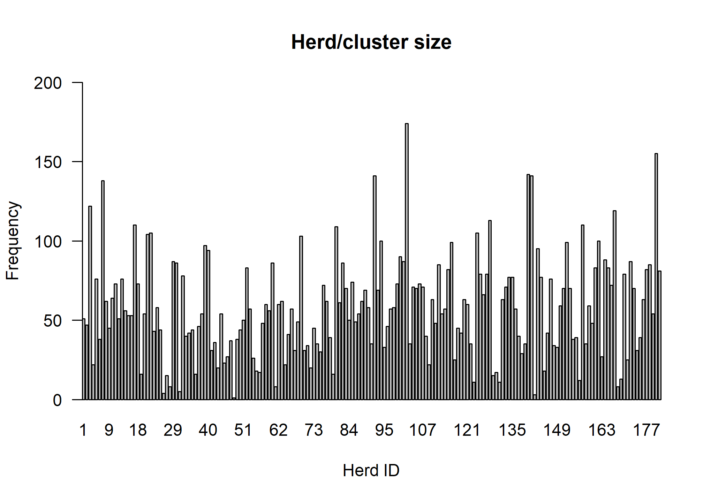
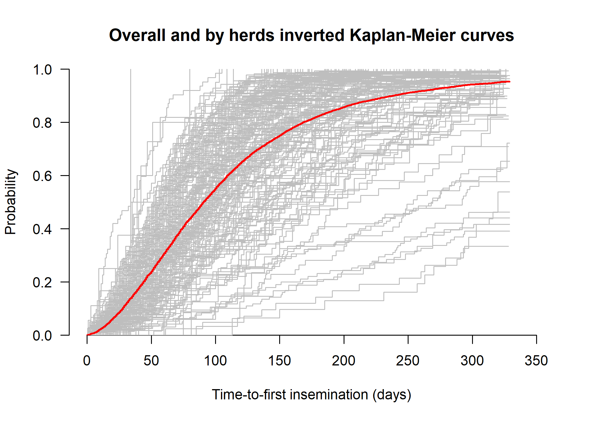

The impact of the number and the size of clusters on prediction
performance of the stratified and the conditional shared gamma frailty
Cox proportional hazards models
================
Daniele Giardiello, Edoardo Ratti, Peter C. Austin

- [**Overview**](#overview)
- [**Some useful notations**](#some-useful-notations)
- [**Load packages**](#load-packages)
- [**Import useful functions**](#import-useful-functions)
- [**Import data**](#import-data)
- [**1. Descriptive statistics**](#1-descriptive-statistics)
- [**2. Analysis**](#2-analysis)
  - [**2.1 Small cluster size**](#21-small-cluster-size)
  - [**2.2 Large cluster size**](#22-large-cluster-size)
- [**3. Additional investigations**](#3-additional-investigations)
- [**Reproducibility ticket**](#reproducibility-ticket)

### **Overview**

We illustrate the analysis of the case study accompanying the simulation
study about the impact of the size and the number of clusters on
prediction performance of the stratified and the conditional shared
gamma frailty Cox proportional hazards models. The case study is the
insem data from the R package
[`parfm`](https://cran.r-project.org/web/packages/parfm/index.html)
described by the book of Duchateau and Janssen [The Frailty
Model](https://link.springer.com/book/10.1007/978-0-387-72835-3) (2008)
(example 1.8)

### **Some useful notations**

Two type of predictions may be possible using frailty:

- Conditional: predictions given the frailty/random effects  
  For the shared gamma frailty:  
  $$S_{ij}(t) = exp[-z_ie^{x_{ij}\beta}H_o(t)] = exp[-H_0(t)e^{x_{ij}\beta+\mu_j}] = exp[-z_jH(t)] = exp[-H(t)e^{\mu_j}]$$

  where $$Z_j \sim \Gamma(\theta, \theta)$$ and

  $$\mu_j = log(Z_j)$$ where $i = 1,..., n_{j}$ represents the $i^{th}$
  subject and $j = 1,...,N$ represents the $j^{th}$ cluster.  
  The measure of within-cluster correlation is Kendall’s $\tau$. For the
  shared gamma frailty model, $\tau = \sigma^2/(\sigma^2+2)$ where
  $\sigma^2$ is the variance of $Z_{j}$. The higher is the variance, the
  higher within-cluster correlation (i.e., homogeneity). Note that
  $Z_j \sim \Gamma(\theta, \theta)$ then the variance is
  $\sigma^2 = 1/\theta$ then $\tau = 1/(\theta+2)$. For details see
  Hougaard *Analysis of Multivariate Survival Data (chapter 4)* [link
  here](https://link.springer.com/book/10.1007/978-1-4612-1304-8), and
  Collett *Modelling Survival Data in Medical Research,
  $4^{th} edition, (chapter 10)$* [link
  here](https://www.routledge.com/Modelling-Survival-Data-in-Medical-Research/Collett/p/book/9781032252858?srsltid=AfmBOoo42UNiACd_DKYssyHu1jihtRGMmlOOjDOYl3vCK47gjs4BW1pW).

- Marginal: integrating over frailty/random effects  
  For the shared gamma frailty the marginal predictions may be used when
  the new individual does not belong to any cluster used to develop the
  model or to estimate predictions integrating over all frailty
  Conditional predictions can be used when the new individual belongs to
  a cluster used to develop the model.

$$S^*_i(t) = [1 + \theta^{-1}e^{\beta x_{ij}}H_0(t)]^{-\theta}$$

### **Load packages**

The following libraries are needed to achieve the following goals, if
you have not them installed, please use install.packages(’‘)
(e.g. install.packages(’survival’)) or use the user-friendly approach if
you are using RStudio.

``` r
# Use pacman to check whether packages are installed, if not load
if (!require("pacman")) install.packages("pacman")
library(pacman)

pacman::p_load(
  rio,
  stringr,
  knitr,
  kableExtra,
  Hmisc,
  lattice,
  riskRegression,
  polspline,
  gtsummary,
  tidyverse,
  grid,
  gridExtra,
  webshot,
  plotly,
  ggplot2,
  ggpubr,
  patchwork,
  rms,
  webshot2,
  parfm,
  frailtyHL
)
```

### **Import useful functions**

We import useful functions

``` r
# Useful functions
source(here::here("Functions/predict.coxph.gammafrail.R"))


#' @description
#' 
#' Function to estimate conditional and marginal 
#' survival probabilities at specified time horizons
#' for shared Gamma frailty Cox proportional hazards models
#' 
#' @author Daniele Giardiello
#' @param model cox model using survival::coxph including frailty gamma term
#' The event of interest must have the indicator variable equal to 1.
#' The model survival::coxph() must specify y = T survival::coxph(..., y = T)
#' The user must define a reference value
#' for all predictors, especially the continuous predictors
#' Example: age50 = age - 50 or age_c = age - mean(age)
#' Then "the baseline" corresponds to a subject with 
#' the specified reference predictors values. 
#' Ties/methods must be "breslow". 
#' @param newdata newdata (for validation). 
#' This should have the same variables of the model.
#' Predictors with levels should be coded 
#' with exactly the same way and levels of the predictors
#' with factors used to develop the model
#' @param cluster cluster variable. Only one variable possible
#' @param times prediction horizon time(s)
#' @examples
#' # example code
#' data(lung, package = "survival")
#' lung$age_c <- lung$age - mean(lung$age)
#' cox_frailty_lung <- survival::coxph(Surv(time, status) ~ age_c + frailty(inst,
#' distribution = "gamma"), 
#' data = lung,
#' x = TRUE,
#' y = TRUE,
#' model = TRUE,
#' ties = "breslow")
#' predict.coxph.gammafrail(model = cox_frailty_lung,
#' newdata = lung_sel,
#' cluster = "inst",
#' times = c(100, 200, 300))
#' @references Collett D - Modelling Survival data in Medical Research, 
#' 4th edition chapter 10 (formula 10.9 and 10.12)


# **Disclaimers**
# 1. The current functions provided the conditional estimated
# predictions using the shared gamma frailty Cox model using
# survival::coxph.
# Left-truncation, non-linear terms and stratification terms
# have not been implemented and tested yet. 

# 2. Marginal prediction estimation are still
# experimental. We do not advice to use it yet.
# Your suggestions to improve the function are kindly and warmly welcome. 

predict.coxph.gammafrail <- function(model,
                                     newdata,
                                     cluster,
                                     times) {
  
  # sanity check message warning
  on.exit(base::message("
  Sanity check warning: 
  please center all variables before fitting the model or assign reference values
                for continuous variable. 
                For example age50 = age - 50.
                newdata should contain the centered/referenced values"))
  
  # Stopping messages
  if (!inherits(model, "coxph"))
    stop("`model` must be a survival::coxph fit. 
         The model must specify y = T and Breslow method. 
         Please center all variables before fitting the model or assign reference values
         for continuous variable. For example age50 = age - 50")
  
  if (missing(cluster))
    stop("Please supply the name of the cluster variable (character).")
  
  if (!is.character(cluster) || length(cluster) != 1L)
    stop("`cluster` must be a single character string giving the cluster column name.")
  
  if (!cluster %in% names(newdata))
    stop("`cluster` not found in `newdata`.")
  
  
  # Start function ----
  # Step0: 
  # Formula with all terms including cluster as it is a fixed covariate
  frm_allterms <- reformulate(base::all.vars(model$formula[[3]]))
  
  # Select the complete cases of fixed + frailty terms
  # of the development data
  # (same data used to develop the model)
  # The argument survival::coxph(..., x = T) provides
  # the development data
  # NOTE: the development data is necessary to 
  # estimate the "baseline" (cumulative) hazard H0 later
  
  devdata <- stats::model.frame(frm_allterms,
                                data = base::eval(model$call$data, 
                                                  envir = environment(formula(model))), 
                                # NOTE: data.frame(model$x) did not
                                # provide the same variable names
                                # (e.g. frailty(id_cluster) instead of id_cluster)
                                # Alternative: add devdata as a new argument of the
                                # function. 
                                # The alternative option is probably the most
                                # intuitive 
                                na.action = na.omit) # not sure if necessary but safer
  
  
  # Select only the complete cases of fixed + frailty terms
  # of the newdata
  
  newdata <- stats::model.frame(frm_allterms,
                                data = newdata,
                                na.action = na.omit)
  
  # Step 1: survfit for
  # a baseline cumulative hazard / survival
  
  # Survfit of the coxph with frailty
  # sf_model <- survival::survfit(model)
  
  # NOTE: the survival::survfit with frailty does not accept newdata
  # thus, it is important to center all variables or give them a reference.
  # In this setting survfit$cumhaz will directly represent our baseline 

  # NOTE: [20251029]: survfit() with frailty with no newdata 
  # seems not to include the frailty terms in the "baseline"
  # cumulative hazard estimation for a reference subject
  
  # Step 1: linear predictors of fixed effects
  
  # Estimate linear predictors only
  # for fixed-effect effects without frailties
  # This will be also useful later when 
  # marginal predictions are estimated

  
  # Since with clusters size < vs >= 5
  # frailty terms are treated as coefficients or not,
  # I prefer calculate lp for the only fixed terms only manually
  
  # lp calculation for marginal
  # save all model coefficients
  # for cluster < 5, frailty terms are included in coefficients (not practical)
  coefs <- model$coefficients
  
  # Remove frailty named "gamma"
  # NOTE/WARNING: 
  # if a variables called gamma it must be a problem
  # to be adjusted
  coefs_fixed <- coefs[!base::grepl("gamma", names(coefs))]
  
  # create formula of fixed terms only
  terms_vec <- attr(terms(model$formula), 
                    "term.labels")
  
  # Remove specials using grep/grepl
  # NOTE: working in progress
  specials <- c("frailty", "strata", "cluster", "offset", "tt")
  fixed_terms <- terms_vec[!grepl(paste(specials, collapse = "|"), terms_vec)]

  
  formula_fixed <- stats::reformulate(fixed_terms,
                                      response = NULL)
  
  # create design matrix of fixed term only
  # of the new data
  X_fixed <- model.matrix(formula_fixed,
                          newdata)

  X_fixed <- X_fixed[, colnames(X_fixed) != "(Intercept)"]

  # estimate linear predictor X*beta fixed term only
  lp_fixed <- X_fixed %*% cbind(coefs_fixed)
  
  # this should be equivalent to this (when cluster > 5)
  # lp_nofrail <- cbind(predict(model,
  #                             newdata = newdata,
  #                             type = "lp"))
  
  # create design matrix of fixed term only
  # of the development data
  # (data used to develop the model)
  # useful to estimate the "baseline" cumulative hazard
  X_fixed_dev <- model.matrix(formula_fixed,
                              devdata)
  
  X_fixed_dev <- X_fixed_dev[, colnames(X_fixed_dev) != "(Intercept)"]
  
  # estimate linear predictor X*beta fixed term only
  lp_fixed_dev <- X_fixed_dev %*% cbind(coefs_fixed)
  
  
  # Step 2: linear predictors for frailty terms
  
  # NOTE/WARNING:
  # for cluster < 5 predict.coxph(model, newdata) includes also frailty
  # and frailty terms must not be included for marginal predictions.
  # This leads to wrong estimations of marginal predictions 
  # and the corresponding performance metrics in riskRegression::Score()
  
  # For frailty with not model$frail (where clusters < 5)
  # add the model$frail and keep only fixed-effect coefficients
  if(is.null(model$frail)) {
    coefs_model <- model$coefficients
    model$frail <- unname(coefs_model[base::grep("gamma", names(coefs_model))])
  }
  
  # Force cluster as a factor in the newdata
  # number of clusters in the newdata 
  
  # otherwise a factor
  # NOTE: for newdata with one cluster, factor does not work
  # newdata[[cluster]] <- base::as.character(newdata[[cluster]])
  
  # newdata 
   newdata[[cluster]] <- base::factor(newdata[[cluster]],
                                      levels = unique(newdata[[cluster]]))
   
  # development data
   devdata[[cluster]] <- base::factor(devdata[[cluster]],
                                      levels = unique(devdata[[cluster]]))
  
  # newdata[[cluster]] <- base::factor(newdata[[cluster]],
  #                                    levels = 1:length(model$frail))
   
  # Create the design matrix for frailty terms
  all_terms <- base::all.vars(model$formula[[3]])
  frailty_terms <- c(-1, all_terms[all_terms == cluster])
  
  # design matrix for the frailty terms
  # of the new data
  X_frail <- stats::model.matrix(stats::reformulate(frailty_terms),
                                 response = NULL,
                                 data = newdata)
  
  # design matrix for the frailty terms
  # of the development data (data used to develop the model)
  # useful to estimate the "baseline" cumulative hazard H0
  X_frail_dev <- stats::model.matrix(stats::reformulate(frailty_terms),
                                     response = NULL,
                                     data = devdata)
  
  # Frailty terms linear predictors
  # new data
  lp_frail <- X_frail %*% cbind(model$frail)
  
  # Frailty terms linear predictors
  # development data
  lp_frail_dev <- X_frail_dev %*% cbind(model$frail)
  
  # Total linear predictor
  # new data
  lp_total <- lp_fixed + lp_frail
  
  # Total linear predictor
  # development data
  lp_total_dev <- lp_fixed_dev + lp_frail_dev
  
  # Step 3: 
  # estimate the "baseline" cumulative hazard
  # for a reference subject 
  # NOTE: we use the development data
  # NOTE: recalibration might be possible using
  # the linear predictors (lp) of the development data
  # but the risk setting of the newdata (i.e., validation)
  # It might be considered as future developments
  
  risk_dev <- exp(lp_total_dev) # exp(lp + frailty)

  # Unique event times of the
  # model fitted using the development data
  
  model_times <- model$y[, "time"] # event time for development data
  model_status <- model$y[, "status"] # event indicator for development data
  
  # NOTE: the object model must specify y = T
  # Example: survival::coxph(..., y = T)
  # NOTE: status == 1 must be the event of reference
  
  # Extract the unique event time
  # from the development data
  # used to develop the model
  unique_event_times <- sort(unique(model_times[model_status == 1]))
  n_times <- length(unique_event_times)
  
  # Initialize vectors
  h0 <- numeric(n_times)    # incremental baseline hazard
  d_i <- numeric(n_times)   # number of events at each time
  
  for (i in seq_along(unique_event_times)) {
    t <- unique_event_times[i]
    d_i[i] <- sum(model_status[model_times == t])
    
    # Risk set: all individuals still at risk at time t
    risk_set <- which(model_times >= t)
    
    # Breslow baseline hazard
    h0[i] <- d_i[i] / sum(risk_dev[risk_set])
  }
 
  # Cumulative "baseline" hazard
  # Create the sf model
  H0 <- cumsum(h0)
  
  # Cumulative hazards
  # at fixed time horizons
  # H_0(t)
  cumhaz0_thor <- stats::approx(
    x = unique_event_times,
    y = H0,
    yleft = 0, # y values below min(x). Cumulative hazard zero if below min(time)
    yright = NA, # y values above max(x). Cumulative hazard NA if above max(time)
    xout = times,
    method = "constant",
    f = 0,
    rule = 1)$y
  
  # NOTE: 
  # stats:approx should work fine since
  # all values from survival::survfit are unique
  # for the event time of development data
  
  # H(t) using the newdata (i.e., validation data)
  cumhaz_thor <- exp(lp_total) %*% cumhaz0_thor
  
  # conditional S(t)
  S_cond_t <- exp(-cumhaz_thor)
  
  # marginal S(t)
  # NOTE: marginal predictions needs
  # to be further investigated
  # to check if they are corrected
  # 
  # NOTE/QUESTION
  # does the marginal use the baseline hazard including the frailty terms?
  
  theta_hat <- model$history[[1]]$theta
  S_marg_t <- (1 + theta_hat * (exp(lp_fixed) %*% cumhaz0_thor))^(-1/theta_hat)
  
  # Output 
  # NOTE: to be better defined
  res <- list("conditional" = S_cond_t,
              "marginal" = S_marg_t)
  
  return(res)
  # Report only conditional predictions
  # return(S_cond_t)
  
}


# smoothed calibration function

calhaz_map <- function(time,
                       status,
                       covariates,
                       t_hors,
                       predictions) {
  
  tryCatch(
    {
  
  # Hazard regression
  calhaz_mod <- polspline::hare(data = time,
                                delta = status,
                                cov = covariates)
  
  # estimated cumulative probability
  pred_calhaz <- polspline::phare(t_hors,
                                  cov = covariates,
                                  fit = calhaz_mod)
  
  # ICI/E50/E90
  ICI <- mean(abs(pred_calhaz - predictions),
              na.rm = T)
  
  E50 <- median(abs(pred_calhaz - predictions),
                na.rm = T)
  
  E90 <- quantile(abs(pred_calhaz - predictions),
                  probs = .90,
                  na.rm = T)
  
  res <- c(ICI, E50, E90)
  res},
  
  error = function(msg) {
    message(paste("Calibration not possible"))
    rep(NA, 3)})
  
}
```

### **Import data**

Insem data can be imported using the `parfm` R package. We also saved
insem data in our repository in the .rds format.

``` r
# Import from the repository
# insem <- readRDS(here::here("Data/insem.rds"))

# Import from parf package
data(insem,
     package = "parfm")
```

### **1. Descriptive statistics**

We provide some descriptive statistics of the case study

``` r
insem_tab_01 <-
  insem %>%
  dplyr::select(Ureum,
                Protein,
                Parity,
                Heifer,
                Status)

label(insem_tab_01$Ureum) <- "Milk urem concentration (%) at the start of the 
                              lactation period"
label(insem_tab_01$Protein) <- "Protein concentration (%) at the start of the 
                                lactation period"
label(insem_tab_01$Parity) <- "The number of calvings"
label(insem_tab_01$Heifer) <- "Primiparous cow"
label(insem_tab_01$Status) <- "Inseminated cow"

units(insem_tab_01$Ureum) <- "%"
units(insem_tab_01$Protein) <- "%"

gtsummary_table1 <-
  gtsummary::tbl_summary(
    data = insem_tab_01 ,
    label = list(Parity ~ "Number of calvings", 
                 Heifer ~ "Primiparous cow", 
                 Ureum ~ "Milk urem concentration (%) ",
                 Protein ~ "Protein concentration (%)",
                 Status ~ "Inseminated cows"),
    type = all_continuous() ~ "continuous2",
    statistic = all_continuous() ~ c(
      "{mean} ({sd})",
      "{median} ({min}, {max})"
    ),
  ) 

gtsummary_table1 %>%
  gtsummary::as_gt()
```

<div id="witzcaapye" style="padding-left:0px;padding-right:0px;padding-top:10px;padding-bottom:10px;overflow-x:auto;overflow-y:auto;width:auto;height:auto;">
<style>#witzcaapye table {
  font-family: system-ui, 'Segoe UI', Roboto, Helvetica, Arial, sans-serif, 'Apple Color Emoji', 'Segoe UI Emoji', 'Segoe UI Symbol', 'Noto Color Emoji';
  -webkit-font-smoothing: antialiased;
  -moz-osx-font-smoothing: grayscale;
}
&#10;#witzcaapye thead, #witzcaapye tbody, #witzcaapye tfoot, #witzcaapye tr, #witzcaapye td, #witzcaapye th {
  border-style: none;
}
&#10;#witzcaapye p {
  margin: 0;
  padding: 0;
}
&#10;#witzcaapye .gt_table {
  display: table;
  border-collapse: collapse;
  line-height: normal;
  margin-left: auto;
  margin-right: auto;
  color: #333333;
  font-size: 16px;
  font-weight: normal;
  font-style: normal;
  background-color: #FFFFFF;
  width: auto;
  border-top-style: solid;
  border-top-width: 2px;
  border-top-color: #A8A8A8;
  border-right-style: none;
  border-right-width: 2px;
  border-right-color: #D3D3D3;
  border-bottom-style: solid;
  border-bottom-width: 2px;
  border-bottom-color: #A8A8A8;
  border-left-style: none;
  border-left-width: 2px;
  border-left-color: #D3D3D3;
}
&#10;#witzcaapye .gt_caption {
  padding-top: 4px;
  padding-bottom: 4px;
}
&#10;#witzcaapye .gt_title {
  color: #333333;
  font-size: 125%;
  font-weight: initial;
  padding-top: 4px;
  padding-bottom: 4px;
  padding-left: 5px;
  padding-right: 5px;
  border-bottom-color: #FFFFFF;
  border-bottom-width: 0;
}
&#10;#witzcaapye .gt_subtitle {
  color: #333333;
  font-size: 85%;
  font-weight: initial;
  padding-top: 3px;
  padding-bottom: 5px;
  padding-left: 5px;
  padding-right: 5px;
  border-top-color: #FFFFFF;
  border-top-width: 0;
}
&#10;#witzcaapye .gt_heading {
  background-color: #FFFFFF;
  text-align: center;
  border-bottom-color: #FFFFFF;
  border-left-style: none;
  border-left-width: 1px;
  border-left-color: #D3D3D3;
  border-right-style: none;
  border-right-width: 1px;
  border-right-color: #D3D3D3;
}
&#10;#witzcaapye .gt_bottom_border {
  border-bottom-style: solid;
  border-bottom-width: 2px;
  border-bottom-color: #D3D3D3;
}
&#10;#witzcaapye .gt_col_headings {
  border-top-style: solid;
  border-top-width: 2px;
  border-top-color: #D3D3D3;
  border-bottom-style: solid;
  border-bottom-width: 2px;
  border-bottom-color: #D3D3D3;
  border-left-style: none;
  border-left-width: 1px;
  border-left-color: #D3D3D3;
  border-right-style: none;
  border-right-width: 1px;
  border-right-color: #D3D3D3;
}
&#10;#witzcaapye .gt_col_heading {
  color: #333333;
  background-color: #FFFFFF;
  font-size: 100%;
  font-weight: normal;
  text-transform: inherit;
  border-left-style: none;
  border-left-width: 1px;
  border-left-color: #D3D3D3;
  border-right-style: none;
  border-right-width: 1px;
  border-right-color: #D3D3D3;
  vertical-align: bottom;
  padding-top: 5px;
  padding-bottom: 6px;
  padding-left: 5px;
  padding-right: 5px;
  overflow-x: hidden;
}
&#10;#witzcaapye .gt_column_spanner_outer {
  color: #333333;
  background-color: #FFFFFF;
  font-size: 100%;
  font-weight: normal;
  text-transform: inherit;
  padding-top: 0;
  padding-bottom: 0;
  padding-left: 4px;
  padding-right: 4px;
}
&#10;#witzcaapye .gt_column_spanner_outer:first-child {
  padding-left: 0;
}
&#10;#witzcaapye .gt_column_spanner_outer:last-child {
  padding-right: 0;
}
&#10;#witzcaapye .gt_column_spanner {
  border-bottom-style: solid;
  border-bottom-width: 2px;
  border-bottom-color: #D3D3D3;
  vertical-align: bottom;
  padding-top: 5px;
  padding-bottom: 5px;
  overflow-x: hidden;
  display: inline-block;
  width: 100%;
}
&#10;#witzcaapye .gt_spanner_row {
  border-bottom-style: hidden;
}
&#10;#witzcaapye .gt_group_heading {
  padding-top: 8px;
  padding-bottom: 8px;
  padding-left: 5px;
  padding-right: 5px;
  color: #333333;
  background-color: #FFFFFF;
  font-size: 100%;
  font-weight: initial;
  text-transform: inherit;
  border-top-style: solid;
  border-top-width: 2px;
  border-top-color: #D3D3D3;
  border-bottom-style: solid;
  border-bottom-width: 2px;
  border-bottom-color: #D3D3D3;
  border-left-style: none;
  border-left-width: 1px;
  border-left-color: #D3D3D3;
  border-right-style: none;
  border-right-width: 1px;
  border-right-color: #D3D3D3;
  vertical-align: middle;
  text-align: left;
}
&#10;#witzcaapye .gt_empty_group_heading {
  padding: 0.5px;
  color: #333333;
  background-color: #FFFFFF;
  font-size: 100%;
  font-weight: initial;
  border-top-style: solid;
  border-top-width: 2px;
  border-top-color: #D3D3D3;
  border-bottom-style: solid;
  border-bottom-width: 2px;
  border-bottom-color: #D3D3D3;
  vertical-align: middle;
}
&#10;#witzcaapye .gt_from_md > :first-child {
  margin-top: 0;
}
&#10;#witzcaapye .gt_from_md > :last-child {
  margin-bottom: 0;
}
&#10;#witzcaapye .gt_row {
  padding-top: 8px;
  padding-bottom: 8px;
  padding-left: 5px;
  padding-right: 5px;
  margin: 10px;
  border-top-style: solid;
  border-top-width: 1px;
  border-top-color: #D3D3D3;
  border-left-style: none;
  border-left-width: 1px;
  border-left-color: #D3D3D3;
  border-right-style: none;
  border-right-width: 1px;
  border-right-color: #D3D3D3;
  vertical-align: middle;
  overflow-x: hidden;
}
&#10;#witzcaapye .gt_stub {
  color: #333333;
  background-color: #FFFFFF;
  font-size: 100%;
  font-weight: initial;
  text-transform: inherit;
  border-right-style: solid;
  border-right-width: 2px;
  border-right-color: #D3D3D3;
  padding-left: 5px;
  padding-right: 5px;
}
&#10;#witzcaapye .gt_stub_row_group {
  color: #333333;
  background-color: #FFFFFF;
  font-size: 100%;
  font-weight: initial;
  text-transform: inherit;
  border-right-style: solid;
  border-right-width: 2px;
  border-right-color: #D3D3D3;
  padding-left: 5px;
  padding-right: 5px;
  vertical-align: top;
}
&#10;#witzcaapye .gt_row_group_first td {
  border-top-width: 2px;
}
&#10;#witzcaapye .gt_row_group_first th {
  border-top-width: 2px;
}
&#10;#witzcaapye .gt_summary_row {
  color: #333333;
  background-color: #FFFFFF;
  text-transform: inherit;
  padding-top: 8px;
  padding-bottom: 8px;
  padding-left: 5px;
  padding-right: 5px;
}
&#10;#witzcaapye .gt_first_summary_row {
  border-top-style: solid;
  border-top-color: #D3D3D3;
}
&#10;#witzcaapye .gt_first_summary_row.thick {
  border-top-width: 2px;
}
&#10;#witzcaapye .gt_last_summary_row {
  padding-top: 8px;
  padding-bottom: 8px;
  padding-left: 5px;
  padding-right: 5px;
  border-bottom-style: solid;
  border-bottom-width: 2px;
  border-bottom-color: #D3D3D3;
}
&#10;#witzcaapye .gt_grand_summary_row {
  color: #333333;
  background-color: #FFFFFF;
  text-transform: inherit;
  padding-top: 8px;
  padding-bottom: 8px;
  padding-left: 5px;
  padding-right: 5px;
}
&#10;#witzcaapye .gt_first_grand_summary_row {
  padding-top: 8px;
  padding-bottom: 8px;
  padding-left: 5px;
  padding-right: 5px;
  border-top-style: double;
  border-top-width: 6px;
  border-top-color: #D3D3D3;
}
&#10;#witzcaapye .gt_last_grand_summary_row_top {
  padding-top: 8px;
  padding-bottom: 8px;
  padding-left: 5px;
  padding-right: 5px;
  border-bottom-style: double;
  border-bottom-width: 6px;
  border-bottom-color: #D3D3D3;
}
&#10;#witzcaapye .gt_striped {
  background-color: rgba(128, 128, 128, 0.05);
}
&#10;#witzcaapye .gt_table_body {
  border-top-style: solid;
  border-top-width: 2px;
  border-top-color: #D3D3D3;
  border-bottom-style: solid;
  border-bottom-width: 2px;
  border-bottom-color: #D3D3D3;
}
&#10;#witzcaapye .gt_footnotes {
  color: #333333;
  background-color: #FFFFFF;
  border-bottom-style: none;
  border-bottom-width: 2px;
  border-bottom-color: #D3D3D3;
  border-left-style: none;
  border-left-width: 2px;
  border-left-color: #D3D3D3;
  border-right-style: none;
  border-right-width: 2px;
  border-right-color: #D3D3D3;
}
&#10;#witzcaapye .gt_footnote {
  margin: 0px;
  font-size: 90%;
  padding-top: 4px;
  padding-bottom: 4px;
  padding-left: 5px;
  padding-right: 5px;
}
&#10;#witzcaapye .gt_sourcenotes {
  color: #333333;
  background-color: #FFFFFF;
  border-bottom-style: none;
  border-bottom-width: 2px;
  border-bottom-color: #D3D3D3;
  border-left-style: none;
  border-left-width: 2px;
  border-left-color: #D3D3D3;
  border-right-style: none;
  border-right-width: 2px;
  border-right-color: #D3D3D3;
}
&#10;#witzcaapye .gt_sourcenote {
  font-size: 90%;
  padding-top: 4px;
  padding-bottom: 4px;
  padding-left: 5px;
  padding-right: 5px;
}
&#10;#witzcaapye .gt_left {
  text-align: left;
}
&#10;#witzcaapye .gt_center {
  text-align: center;
}
&#10;#witzcaapye .gt_right {
  text-align: right;
  font-variant-numeric: tabular-nums;
}
&#10;#witzcaapye .gt_font_normal {
  font-weight: normal;
}
&#10;#witzcaapye .gt_font_bold {
  font-weight: bold;
}
&#10;#witzcaapye .gt_font_italic {
  font-style: italic;
}
&#10;#witzcaapye .gt_super {
  font-size: 65%;
}
&#10;#witzcaapye .gt_footnote_marks {
  font-size: 75%;
  vertical-align: 0.4em;
  position: initial;
}
&#10;#witzcaapye .gt_asterisk {
  font-size: 100%;
  vertical-align: 0;
}
&#10;#witzcaapye .gt_indent_1 {
  text-indent: 5px;
}
&#10;#witzcaapye .gt_indent_2 {
  text-indent: 10px;
}
&#10;#witzcaapye .gt_indent_3 {
  text-indent: 15px;
}
&#10;#witzcaapye .gt_indent_4 {
  text-indent: 20px;
}
&#10;#witzcaapye .gt_indent_5 {
  text-indent: 25px;
}
&#10;#witzcaapye .katex-display {
  display: inline-flex !important;
  margin-bottom: 0.75em !important;
}
&#10;#witzcaapye div.Reactable > div.rt-table > div.rt-thead > div.rt-tr.rt-tr-group-header > div.rt-th-group:after {
  height: 0px !important;
}
</style>
<table class="gt_table" data-quarto-disable-processing="false" data-quarto-bootstrap="false">
  <thead>
    <tr class="gt_col_headings">
      <th class="gt_col_heading gt_columns_bottom_border gt_left" rowspan="1" colspan="1" scope="col" id="label"><span class='gt_from_md'><strong>Characteristic</strong></span></th>
      <th class="gt_col_heading gt_columns_bottom_border gt_center" rowspan="1" colspan="1" scope="col" id="stat_0"><span class='gt_from_md'><strong>N = 10,513</strong></span><span class="gt_footnote_marks" style="white-space:nowrap;font-style:italic;font-weight:normal;line-height:0;"><sup>1</sup></span></th>
    </tr>
  </thead>
  <tbody class="gt_table_body">
    <tr><td headers="label" class="gt_row gt_left">Milk urem concentration (%) </td>
<td headers="stat_0" class="gt_row gt_center"><br /></td></tr>
    <tr><td headers="label" class="gt_row gt_left">    Mean (SD)</td>
<td headers="stat_0" class="gt_row gt_center">2.58 (0.74)</td></tr>
    <tr><td headers="label" class="gt_row gt_left">    Median (Range)</td>
<td headers="stat_0" class="gt_row gt_center">2.55 (0.54, 8.24)</td></tr>
    <tr><td headers="label" class="gt_row gt_left">Protein concentration (%)</td>
<td headers="stat_0" class="gt_row gt_center"><br /></td></tr>
    <tr><td headers="label" class="gt_row gt_left">    Mean (SD)</td>
<td headers="stat_0" class="gt_row gt_center">3.25 (0.34)</td></tr>
    <tr><td headers="label" class="gt_row gt_left">    Median (Range)</td>
<td headers="stat_0" class="gt_row gt_center">3.21 (2.25, 6.48)</td></tr>
    <tr><td headers="label" class="gt_row gt_left">Number of calvings</td>
<td headers="stat_0" class="gt_row gt_center"><br /></td></tr>
    <tr><td headers="label" class="gt_row gt_left">    Mean (SD)</td>
<td headers="stat_0" class="gt_row gt_center">2 (2)</td></tr>
    <tr><td headers="label" class="gt_row gt_left">    Median (Range)</td>
<td headers="stat_0" class="gt_row gt_center">2 (1, 14)</td></tr>
    <tr><td headers="label" class="gt_row gt_left">Primiparous cow</td>
<td headers="stat_0" class="gt_row gt_center">4,200 (40%)</td></tr>
    <tr><td headers="label" class="gt_row gt_left">Inseminated cows</td>
<td headers="stat_0" class="gt_row gt_center">9,939 (95%)</td></tr>
  </tbody>
  &#10;  <tfoot class="gt_footnotes">
    <tr>
      <td class="gt_footnote" colspan="2"><span class="gt_footnote_marks" style="white-space:nowrap;font-style:italic;font-weight:normal;line-height:0;"><sup>1</sup></span> <span class='gt_from_md'>n (%)</span></td>
    </tr>
  </tfoot>
</table>
</div>

``` r
# Cluster size distribution
table_cluster <-
  insem %>%
  dplyr::group_by(Herd) %>%
  dplyr::summarise(n = n()) %>%
  dplyr::arrange(n)

par(xaxs = "i",
    yaxs = "i",
    las = 1)
barplot(table(insem$Herd),
        ylab = "Frequency",
        xlab = "Herd ID",
        ylim = c(0, 200),
        main = "Herd/cluster size")
```



``` r
# kable(table_cluster) %>%
#   kableExtra::kable_styling("striped",
#                             position = "center") %>%
#     kableExtra::add_header_above(
#      c("Cluster size distribution" = 2))

# Summary cluster size
summary_cluster <-
  table_cluster %>%
  dplyr::summarise(min = min(n),
                   q25 = quantile(n, probs = .25),
                   mean = mean(n),
                   sd = sd(n),
                   median = median(n),
                   q75 = quantile(n, probs = .75),
                   max = max(n)) %>%
  round(., 1)

kable(summary_cluster) %>%
  kableExtra::kable_styling("striped") %>%
    kableExtra::add_header_above(
     c("Cluster size statistics" = 7))
```

<table class="table table-striped" style="margin-left: auto; margin-right: auto;">
<thead>
<tr>
<th style="border-bottom:hidden;padding-bottom:0; padding-left:3px;padding-right:3px;text-align: center; " colspan="7">

<div style="border-bottom: 1px solid #ddd; padding-bottom: 5px; ">

Cluster size statistics

</div>

</th>
</tr>
<tr>
<th style="text-align:right;">
min
</th>
<th style="text-align:right;">
q25
</th>
<th style="text-align:right;">
mean
</th>
<th style="text-align:right;">
sd
</th>
<th style="text-align:right;">
median
</th>
<th style="text-align:right;">
q75
</th>
<th style="text-align:right;">
max
</th>
</tr>
</thead>
<tbody>
<tr>
<td style="text-align:right;">
1
</td>
<td style="text-align:right;">
35
</td>
<td style="text-align:right;">
58.1
</td>
<td style="text-align:right;">
31.8
</td>
<td style="text-align:right;">
56
</td>
<td style="text-align:right;">
77
</td>
<td style="text-align:right;">
174
</td>
</tr>
</tbody>
</table>

``` r
# Event distribution per cluster
# kable(
#   addmargins(
#     table(insem$Herd,
#           insem$Status,
#           useNA = "ifany",
#           dnn = c("Cluster",
#                   "Status")))) %>%
#     kableExtra::kable_styling("striped") %>%
#   kableExtra::add_header_above(
#      c("Cluster" = 1,
#        "Status" =  2,
#        "Sum" = 1))
  
# survfit
sf_overall <- survival::survfit(Surv(Time,
                                     Status) ~ 1,
                                data = insem)

sf_cluster <- survival::survfit(Surv(Time,
                                     Status) ~ Herd,
                                data = insem)


par(xaxs = "i",
    yaxs = "i", 
    las = 1)
plot(sf_cluster,
     col = "gray",
     fun = "event",
     xlim = c(0, 350),
     ylim = c(0, 1),
     bty = "n",
     xlab = "Time-to-first insemination (days)",
     ylab = "Probability",
     main = "Overall and by herds inverted Kaplan-Meier curves")
lines(sf_overall,
      fun = "event",
      lwd = 2,
      col = "red",
      conf.int = FALSE)
```



``` r
# Time quantiles
q_overall <- quantile(sf_overall,
                      probs = c(.25, .50, .75))$quantile
q_cluster <- 
  quantile(sf_cluster,
           probs = c(.25, .50, .75))$quantile

q_surv <- rbind.data.frame("Overall" = q_overall,
                           q_cluster)

kable(q_surv[1, ]) %>%
  kableExtra::kable_styling("striped",
                            position = "center") %>%
  kableExtra::add_header_above(
    c(" " = 1,
      "Time quantile" = 3))
```

<table class="table table-striped" style="margin-left: auto; margin-right: auto;">
<thead>
<tr>
<th style="empty-cells: hide;border-bottom:hidden;" colspan="1">
</th>
<th style="border-bottom:hidden;padding-bottom:0; padding-left:3px;padding-right:3px;text-align: center; " colspan="3">

<div style="border-bottom: 1px solid #ddd; padding-bottom: 5px; ">

Time quantile

</div>

</th>
</tr>
<tr>
<th style="text-align:left;">
</th>
<th style="text-align:right;">
25
</th>
<th style="text-align:right;">
50
</th>
<th style="text-align:right;">
75
</th>
</tr>
</thead>
<tbody>
<tr>
<td style="text-align:left;">
Overall
</td>
<td style="text-align:right;">
52
</td>
<td style="text-align:right;">
91
</td>
<td style="text-align:right;">
150
</td>
</tr>
</tbody>
</table>

### **2. Analysis**

We provide the accuracy of predictions from the stratified and the
shared gamma frailty Cox proportional hazards models in two scenarios

- Small cluster scenario: it includes herds with less than 50 cows  
- Large cluster scenario: it includes herds with at least 50 cows

The accuracy of predictions are evaluated in terms of:

- Discrimination using time-varying AUC  
- Calibration using O/E ratio, integrated calibration index (ICI), E50
  and E90  
- Overall performance using time-varying Index of Prediction Accuracy
  (IPA)

We use the Monte Carlo cross-validation procedure to assess prediction
performances of the stratified and frailty Cox model.

- The sample was split into two parts to define derivation (70%) and
  validation samples (30%)  
- The 70/30% random splits are repeated 100 times  
- The repeated random splits are stratified by herds(i.e., the cluster)
  to obtain the same herds in both the derivation and validation samples

We excluded herds with less than 10 cows since it was not possible to
obtain sufficient cows in both derivation and validation sample.

The mean of the performances metrics across the 100 random validation
samples with the corresponding standard deviation are reported for each
scenario and at each prediction time horizon to assess the prediction
performances of the stratified and the frailty Cox models.

The fixed time horizons are defined based on the $25^{th}$, $50^{th}$
and $75^{th}$ quantile fo event time overall distribution using the
Kaplan-Meier distribution which corresponds to 51, 91, 150 days,
respectively.

#### **2.1 Small cluster size**

``` r
# time horizons
time_hors <- c(52, 91, 150)

# reference values for continuous
# predictors
insem_ref <-
  insem %>%
  dplyr::mutate(
    Ureum_ref = Ureum - 2.5,
    Protein_ref = Protein - 2.5,
    Parity_ref = Parity - 2.5)


# Herds >= 50 cows
table_insem_small <-
  insem_ref %>%
  dplyr::count(Herd) %>%
  dplyr::filter(n < 50 & n >= 10)

df_insem_small <- 
  insem_ref %>%
  dplyr::filter(Herd %in% table_insem_small$Herd)

# Repeat B times
B <- 110
df_tbl_insem_ext <- do.call(rbind, 
                        lapply(seq(1:B), 
                               function(k) {
                                 cbind(id = k, df_insem_small)}))
# Nested tibble
set.seed(20250924)
df_tbl_insem <-
  df_tbl_insem_ext %>%
  dplyr::group_nest(id) %>%
  dplyr::mutate(
    # Splitting
    split = purrr::map(.x = data,
                       ~ rsample::initial_split(.x,
                                                strata = Herd,
                                                prop = 0.7,
                                                pool = 0.001)),
    # Development
    development = purrr::map(.x = split,
                             ~ rsample::training(.x)),
      
    # Validation                       
    validation = purrr::map(.x = split,
                             ~ rsample::testing(.x)),
    
    # Check 
    unique_cluster_dev = purrr::map(.x = development,
                                    ~ unique(.x$Herd)),
    
    unique_cluster_val = purrr::map(.x = validation,
                                    ~ unique(.x$Herd)),
    
    check = purrr::map2(.x = unique_cluster_dev,
                        .y = unique_cluster_val,
                        ~ all.equal(.x, .y)))
                                    
                                    
# table(do.call(rbind, df_tbl_insem$check))  
rm(df_tbl_insem_ext)
# gc()
# check
# table(do.call(rbind, df_tbl_insem$check))
# all TRUE

# Rewrite B
B <- 100

# Models + predictions + performances
# tictoc::tic()
df_tbl_insem <-
  df_tbl_insem %>%
  dplyr::filter(check == TRUE) %>%
  dplyr::select(data,
                development,
                validation) %>%
  
  dplyr::mutate(
    cox_strat = purrr::map(.x = development,
                           ~ survival::coxph(Surv(Time, Status) ~ 
                                               Heifer +
                                               Parity_ref +
                                               Ureum_ref + 
                                               Protein_ref +
                                               strata(Herd), 
                                             data = .x,
                                             x = T,
                                             y = T, 
                                             ties = "breslow")),
    
    cox_frail = purrr::map(.x = development,
                           ~ survival::coxph(Surv(Time, Status) ~ 
                                               Heifer +
                                               Parity_ref +
                                               Ureum_ref + 
                                               Protein_ref +  
                                               frailty(Herd), 
                                             data = .x, 
                                             x = T, 
                                             y = T,
                                             ties = "breslow")),
    
    # predictions at t25/t50/t75
    # stratified cox
    pred_strat = purrr::map2(.x = cox_strat,
                             .y = validation,
                             ~ 1 - pec::predictSurvProb(.x,
                                                        newdata = .y,
                                                        times = time_hors)),
    # Extremes to make calibration suitable
    pred_strat = purrr::map(pred_strat,
                            function(x) { 
                              x <- ifelse(x == 0, 0.000001, x)
                              x <- ifelse(x == 1, 0.999999, x)
                              x}),

    # separate prediction by time horizons 
    # due to possible missing values 
    pred_strat_t25 = purrr::map(.x = pred_strat,
                                ~ .x[, 1]),
    
    pred_strat_t50 = purrr::map(.x = pred_strat,
                                ~ .x[, 2]),
    
    pred_strat_t75 = purrr::map(.x = pred_strat,
                                ~ .x[, 3]),
    
    pred_frail = purrr::map2(.x = cox_frail,
                             .y = validation,
                             ~ 1 - predict.coxph.gammafrail.dev(model = .x,
                                                            newdata = .y,
                                                            cluster = "Herd",
                                                            times = time_hors)$conditional),
    # Extremes to make calibration suitable
    pred_frail = purrr::map(pred_frail,
                            function(x) { 
                              x <- ifelse(x == 0, 0.000001, x)
                              x <- ifelse(x == 1, 0.999999, x)
                              x}),
    
    # Score at t25/t50/t75 - frail
    score_frail = purrr::map2(.x = pred_frail,
                              .y = validation,
                              ~ riskRegression::Score(
                                list("frail" = .x),
                                data = .y,
                                formula = Surv(Time, Status) ~ 1,
                                metrics = "auc",
                                summary = "ipa",
                                times = time_hors)),
    
    # save results score - frail
    score_frail_res = purrr::map(score_frail,
                                 function(x) {
                                   
                                   res_AUC <- 
                                     x$AUC$score %>%
                                     dplyr::select(model, times, AUC)
                                   
                                   res_IPA <-
                                     x$Brier$score %>%
                                     dplyr::select(model, times, IPA) %>%
                                     dplyr::filter(model %nin% c("Null model"))
                                   
                                   res <- cbind(res_AUC,
                                                "IPA" = res_IPA$IPA)
                                   
                                   return(res)
                                 }),
                          
    # Score at t25 - strata
   score_strat_t25 = purrr::pmap(
      list(predictions = pred_strat_t25,
           df = validation,
           frm = list(as.formula(Surv(Time, Status) ~ 1)),
           t_hors = list(time_hors[1])),
      Score_tryCatch),
    
    
    # Score at t50 - strata
    score_strat_t50 = purrr::pmap(
      list(predictions = pred_strat_t50,
           df = validation,
           frm = list(as.formula(Surv(Time, Status) ~ 1)),
           t_hors = list(time_hors[2])),
      Score_tryCatch),
    
    # Score at t75 - strata
    score_strat_t75 = purrr::pmap(
      list(predictions = pred_strat_t75,
           df = validation,
           frm = list(as.formula(Surv(Time, Status) ~ 1)),
           t_hors = list(time_hors[3])),
      Score_tryCatch),
    
    
    # cloglog
    # cloglog - strat
    cloglog_pred_strat = purrr::map(pred_strat,
                                    function(x) {
                                      apply(x, 2, function(y) {
                                        log(-log(1 - y))
                                      })
                                    }),
   
   # cloglog - strat t25/t50/t75
   cloglog_pred_strat_t25 = purrr::map(.x = cloglog_pred_strat,
                                       ~ .x[, 1]),
   
   cloglog_pred_strat_t50 = purrr::map(.x = cloglog_pred_strat,
                                       ~ .x[, 2]),
   
   cloglog_pred_strat_t75 = purrr::map(.x = cloglog_pred_strat,
                                       ~ .x[, 3]),
   
    # cloglog
    # cloglog - frail
    cloglog_pred_frail = purrr::map(pred_frail,
                                    function(x) {
                                      apply(x, 2, function(y) {
                                        log(-log(1 - y))
                                      })
                                    }),
   # cloglog - frail t25/t50/t75
    cloglog_pred_frail_t25 = purrr::map(.x = cloglog_pred_frail,
                                        ~ .x[, 1]),
   
    cloglog_pred_frail_t50 = purrr::map(.x = cloglog_pred_frail,
                                        ~ .x[, 2]),
   
    cloglog_pred_frail_t75 = purrr::map(.x = cloglog_pred_frail,
                                        ~ .x[, 3]),
   

    # average expected risk
    pred_avg_strat = purrr::map(pred_strat,
                                function(x){
                                  apply(x, 2, mean)
                                }),
   
    pred_avg_frail = purrr::map(pred_frail,
                                function(x) {
                                 apply(x, 2, mean)
                               }),
   
    # estimated actual risk (estimated obs proportion, observed)
    sf_obs = purrr::map(validation,
                        function(x) {
                          sf_sum <- 
                            summary(survival::survfit(Surv(Time, Status) ~ 1,
                                                      data = x),
                                    extend = TRUE,
                                    times = time_hors)
                          
                          sf_sum$surv[sf_sum$n.risk == 0] <- NA
                          sf_obs_event <- 1 - sf_sum$surv}),
   
   # calibration
   
   # OE ratio - strat
   OE_strat = purrr::map2(.x = sf_obs,
                          .y = pred_avg_strat,
                          ~ .x / .y),
   
    # OE ratio - frail
   OE_frail = purrr::map2(.x = sf_obs,
                          .y = pred_avg_frail,
                          ~ .x / .y),
   
   # ICI/E50/E90 - frail t25
   cal_meas_frail_t25  = purrr::pmap(
     list(time = purrr::map(validation, ~ .x$Time),
          status = purrr::map(validation, ~ .x$Status),
          covariates = cloglog_pred_frail_t25,
          t_hors = list(time_hors[1]),
          predictions = purrr::map(pred_frail, ~ .x[, 1])),
          calhaz_map),
   
   # ICI/E50/E90 - frail t50
   cal_meas_frail_t50  = purrr::pmap(
     list(time = purrr::map(validation, ~ .x$Time),
          status = purrr::map(validation, ~ .x$Status),
          covariates = cloglog_pred_frail_t50,
          t_hors = list(time_hors[2]),
          predictions = purrr::map(pred_frail, ~ .x[, 2])),
          calhaz_map),
   
   # ICI/E50/E90 - frail t75
   cal_meas_frail_t75  = purrr::pmap(
     list(time = purrr::map(validation, ~ .x$Time),
          status = purrr::map(validation, ~ .x$Status),
          covariates = cloglog_pred_frail_t75,
          t_hors = list(time_hors[3]),
          predictions = purrr::map(pred_frail, ~ .x[, 3])),
          calhaz_map),
   
   # stratify
   # ICI/E50/E90 - strat t25
   cal_meas_strat_t25  = purrr::pmap(
     list(time = purrr::map(validation, ~ .x$Time),
          status = purrr::map(validation, ~ .x$Status),
          covariates = cloglog_pred_strat_t25,
          t_hors = list(time_hors[1]),
          predictions = purrr::map(pred_strat, ~ .x[, 1])),
          calhaz_map),
   
   # ICI/E50/E90 - strat t50
   cal_meas_strat_t50  = purrr::pmap(
     list(time = purrr::map(validation, ~ .x$Time),
          status = purrr::map(validation, ~ .x$Status),
          covariates = cloglog_pred_strat_t50,
          t_hors = list(time_hors[2]),
          predictions = purrr::map(pred_strat, ~ .x[, 2])),
          calhaz_map),
   
   # ICI/E50/E90 - strat t75
   cal_meas_strat_t75  = purrr::pmap(
     list(time = purrr::map(validation, ~ .x$Time),
          status = purrr::map(validation, ~ .x$Status),
          covariates = cloglog_pred_strat_t75,
          t_hors = list(time_hors[3]),
          predictions = purrr::map(pred_strat, ~ .x[, 3])),
          calhaz_map))
   
# tictoc::toc()
```

<table class="table table-striped" style="margin-left: auto; margin-right: auto;">
<thead>
<tr>
<th style="border-bottom:hidden;padding-bottom:0; padding-left:3px;padding-right:3px;text-align: center; " colspan="7">

<div style="border-bottom: 1px solid #ddd; padding-bottom: 5px; ">

Small cluster scenario

</div>

</th>
</tr>
<tr>
<th style="empty-cells: hide;border-bottom:hidden;" colspan="3">
</th>
<th style="border-bottom:hidden;padding-bottom:0; padding-left:3px;padding-right:3px;text-align: center; " colspan="2">

<div style="border-bottom: 1px solid #ddd; padding-bottom: 5px; ">

AUC

</div>

</th>
<th style="border-bottom:hidden;padding-bottom:0; padding-left:3px;padding-right:3px;text-align: center; " colspan="2">

<div style="border-bottom: 1px solid #ddd; padding-bottom: 5px; ">

IPA

</div>

</th>
</tr>
<tr>
<th style="text-align:left;">
model
</th>
<th style="text-align:right;">
times
</th>
<th style="text-align:right;">
pct_comp
</th>
<th style="text-align:right;">
AUC_mean
</th>
<th style="text-align:right;">
AUC_sd
</th>
<th style="text-align:right;">
IPA_mean
</th>
<th style="text-align:right;">
IPA_sd
</th>
</tr>
</thead>
<tbody>
<tr>
<td style="text-align:left;">
frail
</td>
<td style="text-align:right;">
52
</td>
<td style="text-align:right;">
100
</td>
<td style="text-align:right;">
0.688
</td>
<td style="text-align:right;">
0.015
</td>
<td style="text-align:right;">
0.075
</td>
<td style="text-align:right;">
0.016
</td>
</tr>
<tr>
<td style="text-align:left;">
strat
</td>
<td style="text-align:right;">
52
</td>
<td style="text-align:right;">
95
</td>
<td style="text-align:right;">
0.658
</td>
<td style="text-align:right;">
0.015
</td>
<td style="text-align:right;">
0.039
</td>
<td style="text-align:right;">
0.021
</td>
</tr>
<tr>
<td style="text-align:left;">
frail
</td>
<td style="text-align:right;">
91
</td>
<td style="text-align:right;">
100
</td>
<td style="text-align:right;">
0.730
</td>
<td style="text-align:right;">
0.016
</td>
<td style="text-align:right;">
0.161
</td>
<td style="text-align:right;">
0.024
</td>
</tr>
<tr>
<td style="text-align:left;">
strat
</td>
<td style="text-align:right;">
91
</td>
<td style="text-align:right;">
78
</td>
<td style="text-align:right;">
0.723
</td>
<td style="text-align:right;">
0.016
</td>
<td style="text-align:right;">
0.146
</td>
<td style="text-align:right;">
0.026
</td>
</tr>
<tr>
<td style="text-align:left;">
frail
</td>
<td style="text-align:right;">
150
</td>
<td style="text-align:right;">
100
</td>
<td style="text-align:right;">
0.813
</td>
<td style="text-align:right;">
0.016
</td>
<td style="text-align:right;">
0.262
</td>
<td style="text-align:right;">
0.033
</td>
</tr>
</tbody>
</table>
<table class="table table-striped" style="margin-left: auto; margin-right: auto;">
<thead>
<tr>
<th style="border-bottom:hidden;padding-bottom:0; padding-left:3px;padding-right:3px;text-align: center; " colspan="5">

<div style="border-bottom: 1px solid #ddd; padding-bottom: 5px; ">

Small cluster scenario

</div>

</th>
</tr>
<tr>
<th style="empty-cells: hide;border-bottom:hidden;" colspan="3">
</th>
<th style="border-bottom:hidden;padding-bottom:0; padding-left:3px;padding-right:3px;text-align: center; " colspan="2">

<div style="border-bottom: 1px solid #ddd; padding-bottom: 5px; ">

O-E ratio

</div>

</th>
</tr>
<tr>
<th style="text-align:left;">
model
</th>
<th style="text-align:right;">
times
</th>
<th style="text-align:right;">
pct_comp
</th>
<th style="text-align:right;">
OE_ratio_mean
</th>
<th style="text-align:right;">
OE_ratio_sd
</th>
</tr>
</thead>
<tbody>
<tr>
<td style="text-align:left;">
frail
</td>
<td style="text-align:right;">
52
</td>
<td style="text-align:right;">
100
</td>
<td style="text-align:right;">
0.994
</td>
<td style="text-align:right;">
0.055
</td>
</tr>
<tr>
<td style="text-align:left;">
strat
</td>
<td style="text-align:right;">
52
</td>
<td style="text-align:right;">
95
</td>
<td style="text-align:right;">
1.024
</td>
<td style="text-align:right;">
0.087
</td>
</tr>
<tr>
<td style="text-align:left;">
frail
</td>
<td style="text-align:right;">
91
</td>
<td style="text-align:right;">
100
</td>
<td style="text-align:right;">
0.999
</td>
<td style="text-align:right;">
0.059
</td>
</tr>
<tr>
<td style="text-align:left;">
strat
</td>
<td style="text-align:right;">
91
</td>
<td style="text-align:right;">
78
</td>
<td style="text-align:right;">
1.023
</td>
<td style="text-align:right;">
0.045
</td>
</tr>
<tr>
<td style="text-align:left;">
frail
</td>
<td style="text-align:right;">
150
</td>
<td style="text-align:right;">
100
</td>
<td style="text-align:right;">
0.987
</td>
<td style="text-align:right;">
0.056
</td>
</tr>
</tbody>
</table>
<table class="table table-striped" style="margin-left: auto; margin-right: auto;">
<thead>
<tr>
<th style="border-bottom:hidden;padding-bottom:0; padding-left:3px;padding-right:3px;text-align: center; " colspan="9">

<div style="border-bottom: 1px solid #ddd; padding-bottom: 5px; ">

Small cluster scenario

</div>

</th>
</tr>
<tr>
<th style="empty-cells: hide;border-bottom:hidden;" colspan="3">
</th>
<th style="border-bottom:hidden;padding-bottom:0; padding-left:3px;padding-right:3px;text-align: center; " colspan="2">

<div style="border-bottom: 1px solid #ddd; padding-bottom: 5px; ">

ICI

</div>

</th>
<th style="border-bottom:hidden;padding-bottom:0; padding-left:3px;padding-right:3px;text-align: center; " colspan="2">

<div style="border-bottom: 1px solid #ddd; padding-bottom: 5px; ">

E50

</div>

</th>
<th style="border-bottom:hidden;padding-bottom:0; padding-left:3px;padding-right:3px;text-align: center; " colspan="2">

<div style="border-bottom: 1px solid #ddd; padding-bottom: 5px; ">

E90

</div>

</th>
</tr>
<tr>
<th style="text-align:left;">
model
</th>
<th style="text-align:right;">
times
</th>
<th style="text-align:right;">
pct_comp
</th>
<th style="text-align:right;">
ICI_mean
</th>
<th style="text-align:right;">
ICI_sd
</th>
<th style="text-align:right;">
E50_mean
</th>
<th style="text-align:right;">
E50_sd
</th>
<th style="text-align:right;">
E90_mean
</th>
<th style="text-align:right;">
E90_sd
</th>
</tr>
</thead>
<tbody>
<tr>
<td style="text-align:left;">
frail
</td>
<td style="text-align:right;">
52
</td>
<td style="text-align:right;">
100
</td>
<td style="text-align:right;">
0.025
</td>
<td style="text-align:right;">
0.013
</td>
<td style="text-align:right;">
0.023
</td>
<td style="text-align:right;">
0.013
</td>
<td style="text-align:right;">
0.046
</td>
<td style="text-align:right;">
0.013
</td>
</tr>
<tr>
<td style="text-align:left;">
strat
</td>
<td style="text-align:right;">
52
</td>
<td style="text-align:right;">
95
</td>
<td style="text-align:right;">
0.037
</td>
<td style="text-align:right;">
0.011
</td>
<td style="text-align:right;">
0.032
</td>
<td style="text-align:right;">
0.013
</td>
<td style="text-align:right;">
0.071
</td>
<td style="text-align:right;">
0.013
</td>
</tr>
<tr>
<td style="text-align:left;">
frail
</td>
<td style="text-align:right;">
91
</td>
<td style="text-align:right;">
100
</td>
<td style="text-align:right;">
0.022
</td>
<td style="text-align:right;">
0.011
</td>
<td style="text-align:right;">
0.021
</td>
<td style="text-align:right;">
0.011
</td>
<td style="text-align:right;">
0.038
</td>
<td style="text-align:right;">
0.011
</td>
</tr>
<tr>
<td style="text-align:left;">
strat
</td>
<td style="text-align:right;">
91
</td>
<td style="text-align:right;">
78
</td>
<td style="text-align:right;">
0.037
</td>
<td style="text-align:right;">
0.014
</td>
<td style="text-align:right;">
0.033
</td>
<td style="text-align:right;">
0.014
</td>
<td style="text-align:right;">
0.064
</td>
<td style="text-align:right;">
0.014
</td>
</tr>
<tr>
<td style="text-align:left;">
frail
</td>
<td style="text-align:right;">
150
</td>
<td style="text-align:right;">
100
</td>
<td style="text-align:right;">
0.022
</td>
<td style="text-align:right;">
0.011
</td>
<td style="text-align:right;">
0.020
</td>
<td style="text-align:right;">
0.011
</td>
<td style="text-align:right;">
0.039
</td>
<td style="text-align:right;">
0.011
</td>
</tr>
</tbody>
</table>

#### **2.2 Large cluster size**

``` r
# time horizons
time_hors <- c(52, 91, 150)

# reference values for continuous
# predictors
insem_ref <-
  insem %>%
  dplyr::mutate(
    Ureum_ref = Ureum - 2.5,
    Protein_ref = Protein - 2.5,
    Parity_ref = Parity - 2.5)


# Herds >= 50 cows
table_insem_large <-
  insem_ref %>%
  dplyr::count(Herd) %>%
  dplyr::filter(n >= 50)

df_insem_large <- 
  insem_ref %>%
  dplyr::filter(Herd %in% table_insem_large$Herd)

# Repeat B times
B <- 100
df_tbl_insem_ext <- do.call(rbind, 
                        lapply(seq(1:B), 
                               function(k) {
                                 cbind(id = k, df_insem_large)}))
# Nested tibble
set.seed(20250924)
df_tbl_insem <-
  df_tbl_insem_ext %>%
  dplyr::group_nest(id) %>%
  dplyr::mutate(
    # Splitting
    split = purrr::map(.x = data,
                       ~ rsample::initial_split(.x,
                                                strata = Herd,
                                                prop = 0.7)),
    # Development
    development = purrr::map(.x = split,
                             ~ rsample::training(.x)),
      
    # Validation                       
    validation = purrr::map(.x = split,
                             ~ rsample::testing(.x)),
    
    # Check 
    unique_cluster_dev = purrr::map(.x = development,
                                    ~ unique(.x$Herd)),
    
    unique_cluster_val = purrr::map(.x = validation,
                                    ~ unique(.x$Herd)),
    
    check = purrr::map2(.x = unique_cluster_dev,
                        .y = unique_cluster_val,
                        ~ all.equal(.x, .y)))
                                    
                                    
  
rm(df_tbl_insem_ext)
# gc()
# check
# table(do.call(rbind, df_tbl_insem$check))
# all TRUE

# Models + predictions + performances
# tictoc::tic()
df_tbl_insem <-
  df_tbl_insem %>%
  dplyr::select(data,
                development,
                validation) %>%
  
  dplyr::mutate(
    cox_strat = purrr::map(.x = development,
                           ~ survival::coxph(Surv(Time, Status) ~ 
                                               Heifer +
                                               Parity_ref +
                                               Ureum_ref + 
                                               Protein_ref +
                                               strata(Herd), 
                                             data = .x,
                                             x = T,
                                             y = T, 
                                             ties = "breslow")),
    
    cox_frail = purrr::map(.x = development,
                           ~ survival::coxph(Surv(Time, Status) ~ 
                                               Heifer +
                                               Parity_ref +
                                               Ureum_ref + 
                                               Protein_ref +  
                                               frailty(Herd), 
                                             data = .x, 
                                             x = T, 
                                             y = T,
                                             ties = "breslow")),
    
    # predictions at t25/t50/t75
    # stratified cox
    pred_strat = purrr::map2(.x = cox_strat,
                             .y = validation,
                             ~ 1 - pec::predictSurvProb(.x,
                                                        newdata = .y,
                                                        times = time_hors)),
    # Extremes to make calibration suitable
    pred_strat = purrr::map(pred_strat,
                            function(x) { 
                              x <- ifelse(x == 0, 0.000001, x)
                              x <- ifelse(x == 1, 0.999999, x)
                              x}),

    # separate prediction by time horizons 
    # due to possible missing values 
    pred_strat_t25 = purrr::map(.x = pred_strat,
                                ~ .x[, 1]),
    
    pred_strat_t50 = purrr::map(.x = pred_strat,
                                ~ .x[, 2]),
    
    pred_strat_t75 = purrr::map(.x = pred_strat,
                                ~ .x[, 3]),
    
    pred_frail = purrr::map2(.x = cox_frail,
                             .y = validation,
                             ~ 1 - predict.coxph.gammafrail.dev(model = .x,
                                                            newdata = .y,
                                                            cluster = "Herd",
                                                            times = time_hors)$conditional),
    # Extremes to make calibration suitable
    pred_frail = purrr::map(pred_frail,
                            function(x) { 
                              x <- ifelse(x == 0, 0.000001, x)
                              x <- ifelse(x == 1, 0.999999, x)
                              x}),
    
    # Score at t25/t50/t75 - frail
    score_frail = purrr::map2(.x = pred_frail,
                              .y = validation,
                              ~ riskRegression::Score(
                                list("frail" = .x),
                                data = .y,
                                formula = Surv(Time, Status) ~ 1,
                                metrics = "auc",
                                summary = "ipa",
                                times = time_hors)),
    
    # save results score - frail
    score_frail_res = purrr::map(score_frail,
                                 function(x) {
                                   
                                   res_AUC <- 
                                     x$AUC$score %>%
                                     dplyr::select(model, times, AUC)
                                   
                                   res_IPA <-
                                     x$Brier$score %>%
                                     dplyr::select(model, times, IPA) %>%
                                     dplyr::filter(model %nin% c("Null model"))
                                   
                                   res <- cbind(res_AUC,
                                                "IPA" = res_IPA$IPA)
                                   
                                   return(res)
                                 }),
                          
    # Score at t25 - strata
   score_strat_t25 = purrr::pmap(
      list(predictions = pred_strat_t25,
           df = validation,
           frm = list(as.formula(Surv(Time, Status) ~ 1)),
           t_hors = list(time_hors[1])),
      Score_tryCatch),
    
    
    # Score at t50 - strata
    score_strat_t50 = purrr::pmap(
      list(predictions = pred_strat_t50,
           df = validation,
           frm = list(as.formula(Surv(Time, Status) ~ 1)),
           t_hors = list(time_hors[2])),
      Score_tryCatch),
    
    # Score at t75 - strata
    score_strat_t75 = purrr::pmap(
      list(predictions = pred_strat_t75,
           df = validation,
           frm = list(as.formula(Surv(Time, Status) ~ 1)),
           t_hors = list(time_hors[3])),
      Score_tryCatch),
    
    
    # cloglog
    # cloglog - strat
    cloglog_pred_strat = purrr::map(pred_strat,
                                    function(x) {
                                      apply(x, 2, function(y) {
                                        log(-log(1 - y))
                                      })
                                    }),
   
   # cloglog - strat t25/t50/t75
   cloglog_pred_strat_t25 = purrr::map(.x = cloglog_pred_strat,
                                       ~ .x[, 1]),
   
   cloglog_pred_strat_t50 = purrr::map(.x = cloglog_pred_strat,
                                       ~ .x[, 2]),
   
   cloglog_pred_strat_t75 = purrr::map(.x = cloglog_pred_strat,
                                       ~ .x[, 3]),
   
    # cloglog
    # cloglog - frail
    cloglog_pred_frail = purrr::map(pred_frail,
                                    function(x) {
                                      apply(x, 2, function(y) {
                                        log(-log(1 - y))
                                      })
                                    }),
   # cloglog - frail t25/t50/t75
    cloglog_pred_frail_t25 = purrr::map(.x = cloglog_pred_frail,
                                        ~ .x[, 1]),
   
    cloglog_pred_frail_t50 = purrr::map(.x = cloglog_pred_frail,
                                        ~ .x[, 2]),
   
    cloglog_pred_frail_t75 = purrr::map(.x = cloglog_pred_frail,
                                        ~ .x[, 3]),
   

    # average expected risk
    pred_avg_strat = purrr::map(pred_strat,
                                function(x){
                                  apply(x, 2, mean)
                                }),
   
    pred_avg_frail = purrr::map(pred_frail,
                                function(x) {
                                 apply(x, 2, mean)
                               }),
   
    # estimated actual risk (estimated obs proportion, observed)
    sf_obs = purrr::map(validation,
                        function(x) {
                          sf_sum <- 
                            summary(survival::survfit(Surv(Time, Status) ~ 1,
                                                      data = x),
                                    extend = TRUE,
                                    times = time_hors)
                          
                          sf_sum$surv[sf_sum$n.risk == 0] <- NA
                          sf_obs_event <- 1 - sf_sum$surv}),
   
   # calibration
   
   # OE ratio - strat
   OE_strat = purrr::map2(.x = sf_obs,
                          .y = pred_avg_strat,
                          ~ .x / .y),
   
    # OE ratio - frail
   OE_frail = purrr::map2(.x = sf_obs,
                          .y = pred_avg_frail,
                          ~ .x / .y),
   
   # ICI/E50/E90 - frail t25
   cal_meas_frail_t25  = purrr::pmap(
     list(time = purrr::map(validation, ~ .x$Time),
          status = purrr::map(validation, ~ .x$Status),
          covariates = cloglog_pred_frail_t25,
          t_hors = list(time_hors[1]),
          predictions = purrr::map(pred_frail, ~ .x[, 1])),
          calhaz_map),
   
   # ICI/E50/E90 - frail t50
   cal_meas_frail_t50  = purrr::pmap(
     list(time = purrr::map(validation, ~ .x$Time),
          status = purrr::map(validation, ~ .x$Status),
          covariates = cloglog_pred_frail_t50,
          t_hors = list(time_hors[2]),
          predictions = purrr::map(pred_frail, ~ .x[, 2])),
          calhaz_map),
   
   # ICI/E50/E90 - frail t75
   cal_meas_frail_t75  = purrr::pmap(
     list(time = purrr::map(validation, ~ .x$Time),
          status = purrr::map(validation, ~ .x$Status),
          covariates = cloglog_pred_frail_t75,
          t_hors = list(time_hors[3]),
          predictions = purrr::map(pred_frail, ~ .x[, 3])),
          calhaz_map),
   
   # stratify
   # ICI/E50/E90 - strat t25
   cal_meas_strat_t25  = purrr::pmap(
     list(time = purrr::map(validation, ~ .x$Time),
          status = purrr::map(validation, ~ .x$Status),
          covariates = cloglog_pred_strat_t25,
          t_hors = list(time_hors[1]),
          predictions = purrr::map(pred_strat, ~ .x[, 1])),
          calhaz_map),
   
   # ICI/E50/E90 - strat t50
   cal_meas_strat_t50  = purrr::pmap(
     list(time = purrr::map(validation, ~ .x$Time),
          status = purrr::map(validation, ~ .x$Status),
          covariates = cloglog_pred_strat_t50,
          t_hors = list(time_hors[2]),
          predictions = purrr::map(pred_strat, ~ .x[, 2])),
          calhaz_map),
   
   # ICI/E50/E90 - strat t75
   cal_meas_strat_t75  = purrr::pmap(
     list(time = purrr::map(validation, ~ .x$Time),
          status = purrr::map(validation, ~ .x$Status),
          covariates = cloglog_pred_strat_t75,
          t_hors = list(time_hors[3]),
          predictions = purrr::map(pred_strat, ~ .x[, 3])),
          calhaz_map))
   
# tictoc::toc()
```

<table class="table table-striped" style="margin-left: auto; margin-right: auto;">
<thead>
<tr>
<th style="border-bottom:hidden;padding-bottom:0; padding-left:3px;padding-right:3px;text-align: center; " colspan="7">

<div style="border-bottom: 1px solid #ddd; padding-bottom: 5px; ">

Large cluster scenario

</div>

</th>
</tr>
<tr>
<th style="empty-cells: hide;border-bottom:hidden;" colspan="3">
</th>
<th style="border-bottom:hidden;padding-bottom:0; padding-left:3px;padding-right:3px;text-align: center; " colspan="2">

<div style="border-bottom: 1px solid #ddd; padding-bottom: 5px; ">

AUC

</div>

</th>
<th style="border-bottom:hidden;padding-bottom:0; padding-left:3px;padding-right:3px;text-align: center; " colspan="2">

<div style="border-bottom: 1px solid #ddd; padding-bottom: 5px; ">

IPA

</div>

</th>
</tr>
<tr>
<th style="text-align:left;">
model
</th>
<th style="text-align:right;">
times
</th>
<th style="text-align:right;">
pct_comp
</th>
<th style="text-align:right;">
AUC_mean
</th>
<th style="text-align:right;">
AUC_sd
</th>
<th style="text-align:right;">
IPA_mean
</th>
<th style="text-align:right;">
IPA_sd
</th>
</tr>
</thead>
<tbody>
<tr>
<td style="text-align:left;">
frail
</td>
<td style="text-align:right;">
52
</td>
<td style="text-align:right;">
100
</td>
<td style="text-align:right;">
0.670
</td>
<td style="text-align:right;">
0.010
</td>
<td style="text-align:right;">
0.068
</td>
<td style="text-align:right;">
0.009
</td>
</tr>
<tr>
<td style="text-align:left;">
strat
</td>
<td style="text-align:right;">
52
</td>
<td style="text-align:right;">
100
</td>
<td style="text-align:right;">
0.656
</td>
<td style="text-align:right;">
0.009
</td>
<td style="text-align:right;">
0.055
</td>
<td style="text-align:right;">
0.009
</td>
</tr>
<tr>
<td style="text-align:left;">
frail
</td>
<td style="text-align:right;">
91
</td>
<td style="text-align:right;">
100
</td>
<td style="text-align:right;">
0.706
</td>
<td style="text-align:right;">
0.008
</td>
<td style="text-align:right;">
0.130
</td>
<td style="text-align:right;">
0.011
</td>
</tr>
<tr>
<td style="text-align:left;">
strat
</td>
<td style="text-align:right;">
91
</td>
<td style="text-align:right;">
97
</td>
<td style="text-align:right;">
0.701
</td>
<td style="text-align:right;">
0.008
</td>
<td style="text-align:right;">
0.124
</td>
<td style="text-align:right;">
0.011
</td>
</tr>
<tr>
<td style="text-align:left;">
frail
</td>
<td style="text-align:right;">
150
</td>
<td style="text-align:right;">
100
</td>
<td style="text-align:right;">
0.776
</td>
<td style="text-align:right;">
0.010
</td>
<td style="text-align:right;">
0.201
</td>
<td style="text-align:right;">
0.017
</td>
</tr>
</tbody>
</table>
<table class="table table-striped" style="margin-left: auto; margin-right: auto;">
<thead>
<tr>
<th style="border-bottom:hidden;padding-bottom:0; padding-left:3px;padding-right:3px;text-align: center; " colspan="5">

<div style="border-bottom: 1px solid #ddd; padding-bottom: 5px; ">

Large cluster scenario

</div>

</th>
</tr>
<tr>
<th style="empty-cells: hide;border-bottom:hidden;" colspan="3">
</th>
<th style="border-bottom:hidden;padding-bottom:0; padding-left:3px;padding-right:3px;text-align: center; " colspan="2">

<div style="border-bottom: 1px solid #ddd; padding-bottom: 5px; ">

O-E ratio

</div>

</th>
</tr>
<tr>
<th style="text-align:left;">
model
</th>
<th style="text-align:right;">
times
</th>
<th style="text-align:right;">
pct_comp
</th>
<th style="text-align:right;">
OE_ratio_mean
</th>
<th style="text-align:right;">
OE_ratio_sd
</th>
</tr>
</thead>
<tbody>
<tr>
<td style="text-align:left;">
frail
</td>
<td style="text-align:right;">
52
</td>
<td style="text-align:right;">
100
</td>
<td style="text-align:right;">
1.005
</td>
<td style="text-align:right;">
0.028
</td>
</tr>
<tr>
<td style="text-align:left;">
strat
</td>
<td style="text-align:right;">
52
</td>
<td style="text-align:right;">
100
</td>
<td style="text-align:right;">
1.015
</td>
<td style="text-align:right;">
0.045
</td>
</tr>
<tr>
<td style="text-align:left;">
frail
</td>
<td style="text-align:right;">
91
</td>
<td style="text-align:right;">
100
</td>
<td style="text-align:right;">
1.001
</td>
<td style="text-align:right;">
0.029
</td>
</tr>
<tr>
<td style="text-align:left;">
strat
</td>
<td style="text-align:right;">
91
</td>
<td style="text-align:right;">
97
</td>
<td style="text-align:right;">
1.011
</td>
<td style="text-align:right;">
0.024
</td>
</tr>
<tr>
<td style="text-align:left;">
frail
</td>
<td style="text-align:right;">
150
</td>
<td style="text-align:right;">
100
</td>
<td style="text-align:right;">
0.998
</td>
<td style="text-align:right;">
0.030
</td>
</tr>
</tbody>
</table>
<table class="table table-striped" style="margin-left: auto; margin-right: auto;">
<thead>
<tr>
<th style="border-bottom:hidden;padding-bottom:0; padding-left:3px;padding-right:3px;text-align: center; " colspan="9">

<div style="border-bottom: 1px solid #ddd; padding-bottom: 5px; ">

Large cluster scenario

</div>

</th>
</tr>
<tr>
<th style="empty-cells: hide;border-bottom:hidden;" colspan="3">
</th>
<th style="border-bottom:hidden;padding-bottom:0; padding-left:3px;padding-right:3px;text-align: center; " colspan="2">

<div style="border-bottom: 1px solid #ddd; padding-bottom: 5px; ">

ICI

</div>

</th>
<th style="border-bottom:hidden;padding-bottom:0; padding-left:3px;padding-right:3px;text-align: center; " colspan="2">

<div style="border-bottom: 1px solid #ddd; padding-bottom: 5px; ">

E50

</div>

</th>
<th style="border-bottom:hidden;padding-bottom:0; padding-left:3px;padding-right:3px;text-align: center; " colspan="2">

<div style="border-bottom: 1px solid #ddd; padding-bottom: 5px; ">

E90

</div>

</th>
</tr>
<tr>
<th style="text-align:left;">
model
</th>
<th style="text-align:right;">
times
</th>
<th style="text-align:right;">
pct_comp
</th>
<th style="text-align:right;">
ICI_mean
</th>
<th style="text-align:right;">
ICI_sd
</th>
<th style="text-align:right;">
E50_mean
</th>
<th style="text-align:right;">
E50_sd
</th>
<th style="text-align:right;">
E90_mean
</th>
<th style="text-align:right;">
E90_sd
</th>
</tr>
</thead>
<tbody>
<tr>
<td style="text-align:left;">
frail
</td>
<td style="text-align:right;">
52
</td>
<td style="text-align:right;">
100
</td>
<td style="text-align:right;">
0.013
</td>
<td style="text-align:right;">
0.014
</td>
<td style="text-align:right;">
0.012
</td>
<td style="text-align:right;">
0.008
</td>
<td style="text-align:right;">
0.023
</td>
<td style="text-align:right;">
0.021
</td>
</tr>
<tr>
<td style="text-align:left;">
strat
</td>
<td style="text-align:right;">
52
</td>
<td style="text-align:right;">
100
</td>
<td style="text-align:right;">
0.026
</td>
<td style="text-align:right;">
0.047
</td>
<td style="text-align:right;">
0.023
</td>
<td style="text-align:right;">
0.039
</td>
<td style="text-align:right;">
0.048
</td>
<td style="text-align:right;">
0.087
</td>
</tr>
<tr>
<td style="text-align:left;">
frail
</td>
<td style="text-align:right;">
91
</td>
<td style="text-align:right;">
100
</td>
<td style="text-align:right;">
0.013
</td>
<td style="text-align:right;">
0.018
</td>
<td style="text-align:right;">
0.011
</td>
<td style="text-align:right;">
0.006
</td>
<td style="text-align:right;">
0.024
</td>
<td style="text-align:right;">
0.041
</td>
</tr>
<tr>
<td style="text-align:left;">
strat
</td>
<td style="text-align:right;">
91
</td>
<td style="text-align:right;">
97
</td>
<td style="text-align:right;">
0.020
</td>
<td style="text-align:right;">
0.009
</td>
<td style="text-align:right;">
0.019
</td>
<td style="text-align:right;">
0.010
</td>
<td style="text-align:right;">
0.036
</td>
<td style="text-align:right;">
0.018
</td>
</tr>
<tr>
<td style="text-align:left;">
frail
</td>
<td style="text-align:right;">
150
</td>
<td style="text-align:right;">
100
</td>
<td style="text-align:right;">
0.015
</td>
<td style="text-align:right;">
0.023
</td>
<td style="text-align:right;">
0.012
</td>
<td style="text-align:right;">
0.007
</td>
<td style="text-align:right;">
0.028
</td>
<td style="text-align:right;">
0.069
</td>
</tr>
</tbody>
</table>

### **3. Additional investigations**

We additionally estimate predictions from the stratified and the shared
gamma frailty Cox model using all data without splitting among clusters
in which predictions were possible in both models.

We provide the corresponding plots of predictions at different time
horizons from the stratified versus the shared gamma frailty model in
the small and large cluster scenario.

``` r
# Herds < 50 (herds >= 10)
table_insem_small <-
  insem %>%
  dplyr::count(Herd) %>%
  dplyr::filter(n < 50 & n >= 10)

# Herds >= 50 cows
table_insem_large <-
  insem %>%
  dplyr::count(Herd) %>%
  dplyr::filter(n >= 50)

df_insem <-
  insem %>%
  # dplyr::filter(Herd %in% table_insem_50$Herd) %>%
  # reference values for all continuous variable
  # to estimate predictions from frailty correctly
  dplyr::mutate(
    Ureum_ref = Ureum - 2.5,
    Protein_ref = Protein - 2.5,
    Parity_ref = Parity - 2.5)

# Small scenario overall data
df_insem_small <- 
  df_insem %>%
  dplyr::filter(Herd %in% table_insem_small$Herd)

# Large scenario overall data
df_insem_large <- 
  df_insem %>%
  dplyr::filter(Herd %in% table_insem_large$Herd)

# Stratified Cox - small
cox_strat_small <-
  survival::coxph(Surv(Time, Status) ~ 
                    Heifer + 
                    Parity_ref +
                    Ureum_ref + 
                    Protein_ref + 
                    strata(Herd), 
      data = df_insem_small, 
      x = T, 
      y = T, 
      ties = "breslow")

# Frailty Cox - small
cox_frail_small <-
  survival::coxph(Surv(Time, Status) ~ 
                    Heifer + 
                    Parity_ref +
                    Ureum_ref + 
                    Protein_ref +  
                    frailty(Herd), 
      data = df_insem_small, 
      x = T, 
      y = T, 
      ties = "breslow")

# Stratified Cox - large
cox_strat_large <-
  survival::coxph(Surv(Time, Status) ~ 
                    Heifer + 
                    Parity_ref +
                    Ureum_ref + 
                    Protein_ref + 
                    strata(Herd), 
      data = df_insem_large, 
      x = T, 
      y = T, 
      ties = "breslow")

# Frailty Cox - small
cox_frail_large <-
  survival::coxph(Surv(Time, Status) ~ 
                    Heifer + 
                    Parity_ref +
                    Ureum_ref + 
                    Protein_ref +  
                    frailty(Herd), 
      data = df_insem_large, 
      x = T, 
      y = T, 
      ties = "breslow")

## Predictions 
# at 25th, 50th, 75th overall percentiles
time_hors <- c(52, 91, 150)
# time_hors <- q_surv[1, ]

# Predictions 
# Stratified small
pred_strat_small <- 1 - pec::predictSurvProb(cox_strat_small,
                                             newdata = df_insem_small,
                                             times = time_hors)

# Frailty small
pred_frail_small <- 1 - predict.coxph.gammafrail.dev(model = cox_frail_small,
                                                 newdata = df_insem_small,
                                                 cluster = "Herd",
                                                 times = time_hors)$conditional

# Predictions 
# Stratified large
pred_strat_large <- 1 - pec::predictSurvProb(cox_strat_large,
                                             newdata = df_insem_large,
                                             times = time_hors)

# Frailty large
pred_frail_large <- 1 - predict.coxph.gammafrail.dev(model = cox_frail_large,
                                                 newdata = df_insem_large,
                                                 cluster = "Herd",
                                                 times = time_hors)$conditional

# Plot predictions
# from stratify and frailty model

# Small scenario at T25, T50 and T75
oldpar <-
  par(
    mfrow = c(2, 3),
    xaxs = "i",
    yaxs = "i",
    las = 1)
plot(pred_strat_small[, 1],
     pred_frail_small[, 1],
     xlim = c(0, 1.2),
     xlab = expression("Predictions from stratified Cox at T"[25]),
     ylim = c(0, 1.2),
     ylab = expression("Predictions from frailty Cox at T"[25]),
     main = expression("Small case scenario at T"[25]),
     bty = "n")
abline(a = 0,
       b = 1,
       lwd = 2,
       col = "red")

par(xaxs = "i",
    yaxs = "i",
    las = 1)
plot(pred_strat_small[, 2],
     pred_frail_small[, 2],
     xlim = c(0, 1.2),
     xlab = expression("Predictions from stratified Cox at T"[50]),
     ylim = c(0, 1.2),
     ylab = expression("Predictions from frailty Cox at T"[50]),
     main = expression("Small case scenario at T"[50]),
     bty = "n")
abline(a = 0,
       b = 1,
       lwd = 2,
       col = "red")

par(xaxs = "i",
    yaxs = "i",
    las = 1)
plot(pred_strat_small[, 3],
     pred_frail_small[, 3],
     xlim = c(0, 1.2),
     xlab = expression("Predictions from stratified Cox at T"[75]),
     ylim = c(0, 1.2),
     ylab = expression("Predictions from frailty Cox at T"[75]),
     main = expression("Small case scenario at T"[75]),
     bty = "n")
abline(a = 0,
       b = 1,
       lwd = 2,
       col = "red")

# Large scenario at T25, T50 and T75
par(xaxs = "i",
    yaxs = "i",
    las = 1)
plot(pred_strat_large[, 1],
     pred_frail_large[, 1],
     xlim = c(0, 1.2),
     xlab = expression("Predictions from stratified Cox at T"[25]),
     ylim = c(0, 1.2),
     ylab = expression("Predictions from frailty Cox at T"[25]),
     main = expression("Large case scenario at T"[25]),
     bty = "n")
abline(a = 0,
       b = 1,
       lwd = 2,
       col = "red")

par(xaxs = "i",
    yaxs = "i",
    las = 1)
plot(pred_strat_large[, 2],
     pred_frail_large[, 2],
     xlim = c(0, 1.2),
     xlab = expression("Predictions from stratified Cox at T"[50]),
     ylim = c(0, 1.2),
     ylab = expression("Predictions from frailty Cox at T"[50]),
     main = expression("Large case scenario at T"[50]),
     bty = "n")
abline(a = 0,
       b = 1,
       lwd = 2,
       col = "red")

par(xaxs = "i",
    yaxs = "i",
    las = 1)
plot(pred_strat_large[, 3],
     pred_frail_large[, 3],
     xlim = c(0, 1.2),
     xlab = expression("Predictions from stratified Cox at T"[75]),
     ylim = c(0, 1.2),
     ylab = expression("Predictions from frailty Cox at T"[75]),
     main = expression("Large case scenario at T"[75]),
     bty = "n")
abline(a = 0,
       b = 1,
       lwd = 2,
       col = "red")
```


NOTE: comparisons only among clusters where predictions were possible
for both models

### **Reproducibility ticket**

``` r
sessionInfo()
```

    ## R version 4.3.3 (2024-02-29 ucrt)
    ## Platform: x86_64-w64-mingw32/x64 (64-bit)
    ## Running under: Windows 10 x64 (build 19045)
    ## 
    ## Matrix products: default
    ## 
    ## 
    ## locale:
    ## [1] LC_COLLATE=English_United Kingdom.utf8 
    ## [2] LC_CTYPE=English_United Kingdom.utf8   
    ## [3] LC_MONETARY=English_United Kingdom.utf8
    ## [4] LC_NUMERIC=C                           
    ## [5] LC_TIME=English_United Kingdom.utf8    
    ## 
    ## time zone: Europe/Rome
    ## tzcode source: internal
    ## 
    ## attached base packages:
    ## [1] grid      stats     graphics  grDevices utils     datasets  methods  
    ## [8] base     
    ## 
    ## other attached packages:
    ##  [1] frailtyHL_2.3             cmprsk_2.2-12            
    ##  [3] Matrix_1.6-5              parfm_2.7.8              
    ##  [5] optimx_2025-4.9           survival_3.8-3           
    ##  [7] webshot2_0.1.2            rms_6.8-0                
    ##  [9] patchwork_1.2.0           ggpubr_0.6.0             
    ## [11] plotly_4.10.4             webshot_0.5.5            
    ## [13] gridExtra_2.3             lubridate_1.9.4          
    ## [15] forcats_1.0.0             dplyr_1.1.4              
    ## [17] purrr_1.0.2               readr_2.1.5              
    ## [19] tidyr_1.3.1               tibble_3.2.1             
    ## [21] ggplot2_3.5.2             tidyverse_2.0.0          
    ## [23] gtsummary_1.7.2           polspline_1.1.25         
    ## [25] riskRegression_2025.05.20 lattice_0.22-5           
    ## [27] Hmisc_5.2-3               kableExtra_1.4.0         
    ## [29] knitr_1.50                stringr_1.5.1            
    ## [31] rio_1.2.3                 pacman_0.5.1             
    ## 
    ## loaded via a namespace (and not attached):
    ##   [1] RColorBrewer_1.1-3   rstudioapi_0.17.1    jsonlite_1.8.9      
    ##   [4] shape_1.4.6.1        magrittr_2.0.3       TH.data_1.1-3       
    ##   [7] farver_2.1.2         nloptr_2.2.1         rmarkdown_2.29      
    ##  [10] vctrs_0.6.5          base64enc_0.1-3      rstatix_0.7.2       
    ##  [13] htmltools_0.5.8.1    broom_1.0.9          Formula_1.2-5       
    ##  [16] sass_0.4.10          parallelly_1.45.1    pracma_2.4.4        
    ##  [19] htmlwidgets_1.6.4    sandwich_3.1-1       zoo_1.8-14          
    ##  [22] gt_1.0.0             commonmark_2.0.0     lifecycle_1.0.4     
    ##  [25] iterators_1.0.14     pkgconfig_2.0.3      R6_2.6.1            
    ##  [28] fastmap_1.2.0        future_1.67.0        digest_0.6.35       
    ##  [31] numDeriv_2016.8-1.1  colorspace_2.1-1     ps_1.9.1            
    ##  [34] rprojroot_2.1.0      timechange_0.3.0     httr_1.4.7          
    ##  [37] abind_1.4-8          compiler_4.3.3       here_1.0.1          
    ##  [40] withr_3.0.2          htmlTable_2.4.3      backports_1.5.0     
    ##  [43] carData_3.0-5        ggsignif_0.6.4       MASS_7.3-60.0.1     
    ##  [46] lava_1.8.1           quantreg_6.1         tools_4.3.3         
    ##  [49] chromote_0.5.1       foreign_0.8-90       future.apply_1.20.0 
    ##  [52] nnet_7.3-20          glue_1.7.0           mets_1.3.5          
    ##  [55] nlme_3.1-164         promises_1.3.2       checkmate_2.3.2     
    ##  [58] cluster_2.1.8.1      generics_0.1.4       gtable_0.3.6        
    ##  [61] tzdb_0.5.0           sn_2.1.1             websocket_1.4.2     
    ##  [64] data.table_1.16.2    hms_1.1.3            xml2_1.3.6          
    ##  [67] car_3.1-3            markdown_2.0         foreach_1.5.2       
    ##  [70] pillar_1.11.0        later_1.4.2          splines_4.3.3       
    ##  [73] SparseM_1.84-2       tidyselect_1.2.1     litedown_0.7        
    ##  [76] svglite_2.1.3        stats4_4.3.3         xfun_0.52           
    ##  [79] expm_1.0-0           stringi_1.8.4        lazyeval_0.2.2      
    ##  [82] yaml_2.3.10          pec_2025.06.24       evaluate_1.0.4      
    ##  [85] codetools_0.2-20     msm_1.8.2            cli_3.6.2           
    ##  [88] rpart_4.1.24         systemfonts_1.2.3    processx_3.8.6      
    ##  [91] Rcpp_1.1.0           globals_0.18.0       parallel_4.3.3      
    ##  [94] MatrixModels_0.5-4   listenv_0.9.1        glmnet_4.1-10       
    ##  [97] viridisLite_0.4.2    broom.helpers_1.15.0 mvtnorm_1.3-3       
    ## [100] timereg_2.0.6        scales_1.4.0         prodlim_2025.04.28  
    ## [103] rlang_1.1.6          multcomp_1.4-28      mnormt_2.1.1
